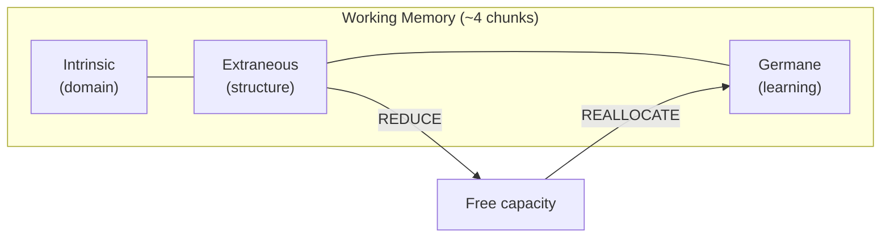
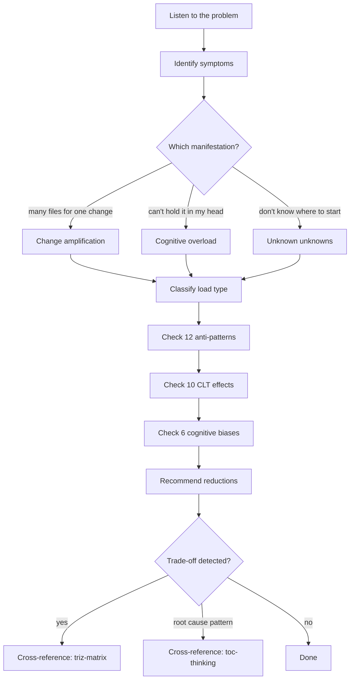
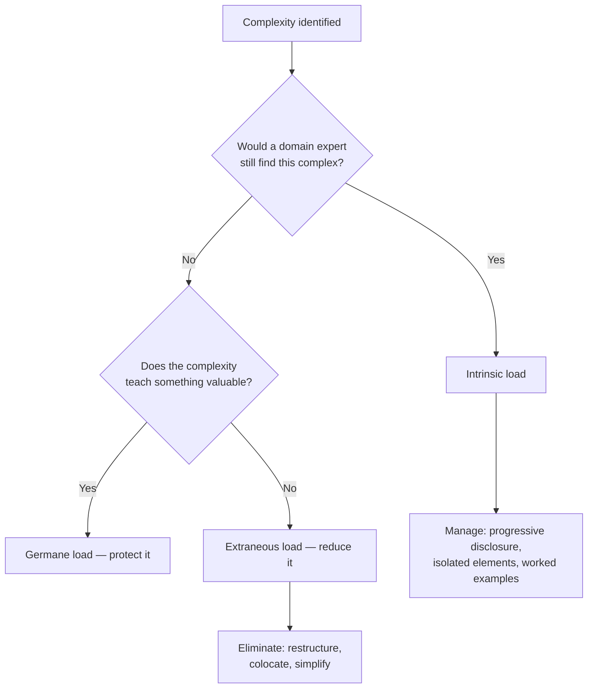
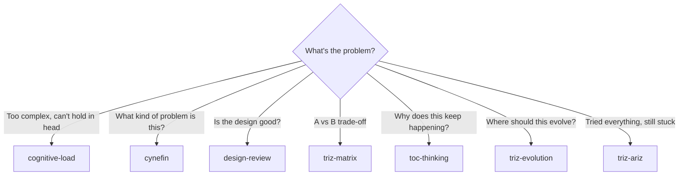
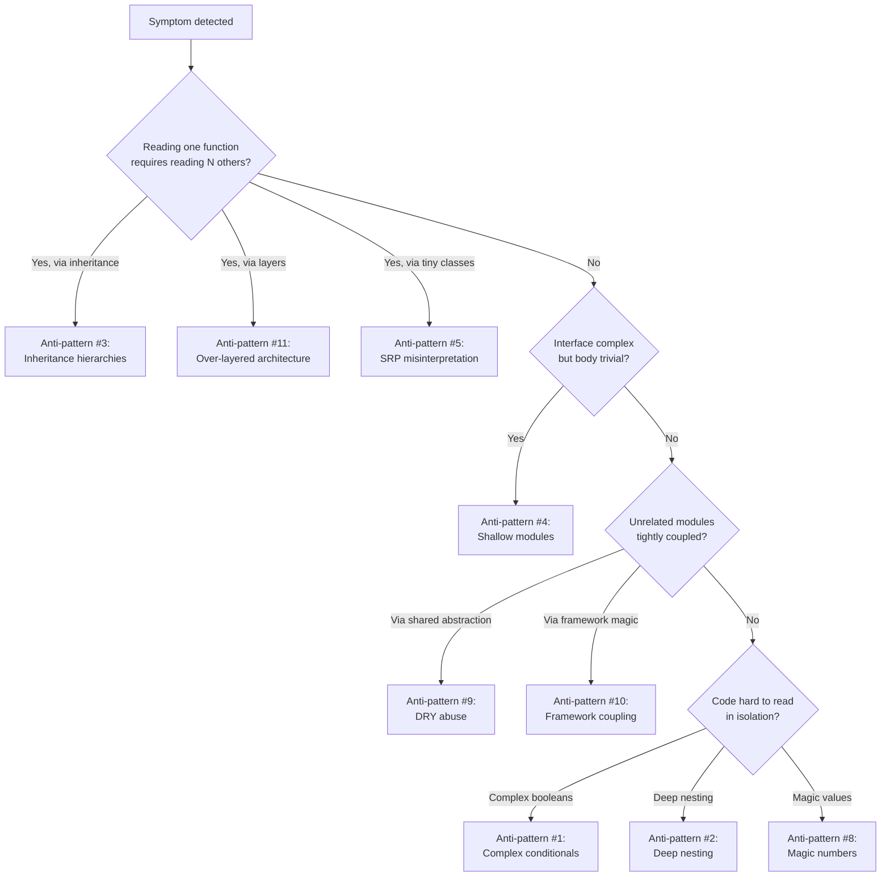

> ⚠️ **This README is for humans only.** LLM agents must NOT reference or load this file from SKILL.md. All instructions for the agent go in SKILL.md exclusively.

# Cognitive Load Theory for Systems & Code

**Sweller's Cognitive Load Theory applied to assessing and reducing unnecessary complexity in systems, interfaces, code, and processes.**

A structured methodology for diagnosing why something feels "too complex", separating inherent domain complexity from avoidable structural complexity, and recommending targeted simplifications.

---

## TL;DR

Cognitive Load Theory (CLT) distinguishes three types of mental load: intrinsic (domain complexity you must accept), extraneous (structural complexity you should eliminate), and germane (learning effort you should protect). Working memory is fixed at roughly 4 chunks. Every unnecessary complication steals capacity from understanding.

This skill walks through a systematic process: identify symptoms, classify load types, check 12 anti-patterns, verify 10 CLT effects, assess 6 cognitive biases, and recommend specific reductions. The goal is always the same: minimize extraneous load so more working memory is available for germane load.

---

## When to Use This Skill

### Use This Skill When

- **"This is too complex"** — but you can't articulate exactly why
- **Code review is overwhelming** — too many things to hold in working memory at once
- **Onboarding takes too long** — new team members can't contribute within days
- **Change velocity is declining** — a simple feature requires understanding 10 modules
- **Architecture review** — is the design comprehensible to its intended audience?
- **Refactoring prioritization** — which simplification yields the most comprehension benefit?
- **Debug time is increasing** — locating bugs takes hours in familiar code
- **Documentation feels insufficient** — but you don't know what's missing

### Don't Use This Skill When

- **Specific parameter trade-off** (latency vs throughput) -- use `triz-matrix`
- **Need to classify the problem type** (obvious vs complex vs chaotic) -- use `cynefin`
- **Checking design quality** (API surface, module depth, red flags) -- use `design-review`
- **Finding root cause of recurring failures** -- use `toc-thinking`
- **Predicting system evolution direction** -- use `triz-evolution`
- **Deep multi-layered contradictions** -- use `triz-ariz`

---

## How It Works

### The Three Types of Cognitive Load

- **Intrinsic**: inherent to the task. WebRTC media negotiation IS complex. Accept it.
- **Extraneous**: imposed by presentation. Component state scattered across 6 Redux slices. Eliminate it.
- **Germane**: productive learning. Understanding WHY a pattern was chosen. Protect it.

Total load = Intrinsic + Extraneous + Germane. Capacity is fixed. Reduce extraneous to free space for germane.

---

### The Analysis Process

---

## Key Concepts

### Three Manifestations of Excess Load

| Manifestation | Symptom | Question to ask |
|--------------|---------|-----------------|
| **Change amplification** | Small logical change touches many places | "How many files for a one-line feature?" |
| **Cognitive overload** | Too many things to hold simultaneously | "How many files must I read to understand this?" |
| **Unknown unknowns** | No mental model of the system | "Where would you even start looking?" |

### 10 CLT Effects

| # | Effect | Core insight |
|---|--------|-------------|
| 1 | Worked Example | Solved examples beat solving from scratch |
| 2 | Split-Attention | Separated related info overloads WM |
| 3 | Redundancy | Redundant info actively harms (not neutral) |
| 4 | Modality | Visual + verbal channels expand effective WM |
| 5 | Expertise Reversal | Novice aids become expert noise |
| 6 | Goal-Free | Undirected exploration can beat prescriptive goals |
| 7 | Isolated Elements | Learn one concept before combining |
| 8 | Completion | Partial solutions (stubs, scaffolding) accelerate learning |
| 9 | Variability | Diverse examples build flexible schemas |
| 10 | Element Interactivity | Effects only manifest with complex material |

### 12 Anti-Patterns

| # | Anti-pattern | Indicator |
|---|-------------|-----------|
| 1 | Complex conditionals | 4+ boolean operators inline |
| 2 | Deep nesting | 3+ levels of if/for/try |
| 3 | Inheritance hierarchies | N files to trace one call |
| 4 | Shallow modules | Complex interface, trivial body |
| 5 | SRP misinterpretation | Explosion of tiny classes |
| 6 | Premature decomposition | Distributed complexity |
| 7 | Feature-rich APIs | Dozens of options/flags |
| 8 | Magic numbers/codes | Numeric literals as business logic |
| 9 | DRY abuse | Coupling unrelated components |
| 10 | Framework tight coupling | Must learn framework internals |
| 11 | Over-layered architecture | Indirection without benefit |
| 12 | Domain model misapplication | Problem-space as solution-space |

### 6 Cognitive Biases That Create Load

| Bias | Mechanism |
|------|-----------|
| **Familiarity** | "I wrote it, so it's clear" |
| **Omission neglect** | Ignoring invisible edge cases |
| **Commitment** | Defending approach past its usefulness |
| **Expertise reversal** | Novice patterns become expert noise |
| **Optimism** | Happy-path only thinking |
| **False consensus** | Assuming others handle complexity the same way |

### 4 Diagnostic Heuristics

| Heuristic | Red flag threshold |
|-----------|-------------------|
| **Debug difficulty** | > 2 hours to locate a bug in familiar code |
| **Change velocity** | Simple change requires 5+ files |
| **Onboarding speed** | > 1 week before first meaningful contribution |
| **40-minute rule** | 40+ minutes of sustained confusion = avoidable extraneous load |

---

## Decision Trees

### Is This Intrinsic or Extraneous?

### Which Skill Should I Use?

### Which Anti-Pattern Is It?

---

## How to Use the Skill

### Command: `/cognitive-load`

Auto-detects the complexity type and walks through the analysis process.

### Interactive Workflow

1. **Describe what feels complex** (module, codebase, process, architecture, onboarding experience)
2. **Claude identifies symptoms** (change amplification, cognitive overload, unknown unknowns)
3. **Classify load types** (intrinsic vs extraneous vs germane for each complaint)
4. **Walk anti-pattern checklist** (which of the 12 apply?)
5. **Check CLT effects** (which principles are being violated?)
6. **Check biases** (is the author affected by familiarity/commitment/optimism bias?)
7. **Recommend** specific, prioritized actions to reduce extraneous load
8. **Cross-reference** other skills if trade-offs or root causes are discovered

---

## Key Insights

### 1. Extraneous Load Is the Only Lever

Intrinsic load is fixed by the domain. Germane load is desirable. Extraneous load is the
only type fully under the designer's control. Focus all simplification efforts here.

### 2. Redundancy Is Actively Harmful

Counter-intuitively, repeating information does not help -- it forces the reader to
reconcile multiple representations and check for differences. One source of truth
always beats three "helpful" copies.

### 3. Expertise Reversal Is Real

Scaffolding that helps novices (detailed comments, step-by-step explanations, type aliases
for simple types) becomes noise for experts. Systems serving mixed audiences need
progressive disclosure, not one-size-fits-all documentation.

### 4. Familiarity Bias Is the Most Common Trap

Authors systematically underestimate the complexity of their own code. The only reliable
test is observing someone unfamiliar try to work with it. The 40-minute rule is a
practical heuristic for detecting this.

### 5. Decomposition Has a Cost

Splitting code into smaller pieces reduces per-unit complexity but increases integration
complexity. There is an optimal granularity where total cognitive load is minimized.
Over-decomposition (anti-patterns #5, #6) can be worse than under-decomposition.

### 6. Deep Modules Beat Shallow Modules

A module that does a lot behind a simple interface (deep) is better than one with a
complex interface that does little (shallow). Depth hides intrinsic complexity;
shallowness converts it to extraneous load for the caller.

---

## When CLT Analysis Works Best

1. **Architecture and design reviews** -- before investing in implementation, assess
   whether the proposed design is comprehensible to its audience
2. **Refactoring prioritization** -- when there are many possible simplifications,
   CLT identifies which reductions yield the most freed working memory
3. **Onboarding friction diagnosis** -- when new team members struggle, CLT pinpoints
   whether the problem is domain complexity (intrinsic) or structural complexity (extraneous)
4. **Code review feedback** -- provides a shared vocabulary (split-attention, shallow module,
   DRY abuse) for discussing complexity objectively
5. **Post-bug analysis** -- when a rendering bug took too long to find, CLT explains why
   and how to prevent similar delays

---

## When NOT to Use CLT

- **Single straightforward question** ("Should I use useMemo here?") -- just answer it
- **Implementation detail** ("How do I type these props?") -- use documentation
- **Already-identified trade-off** -- go straight to `triz-matrix`
- **Known root cause, need a plan** -- go straight to `toc-thinking` PRT/TT

---

## Relationship to Other Skills

| Skill | Relationship |
|-------|-------------|
| **cynefin** | Classifies problem TYPE; CLT assesses solution COMPREHENSIBILITY |
| **design-review** | Checks design QUALITY; CLT checks cognitive IMPACT on readers |
| **triz-matrix** | Resolves trade-offs when reducing load conflicts with other goals |
| **toc-thinking** | Traces multiple complexity symptoms to a single root CAUSE |
| **triz-evolution** | Predicts where a system should evolve (possibly toward simplicity) |
| **triz-ariz** | Deep structured analysis when complexity resists simple solutions |

---

## Troubleshooting

**"The analysis says everything is extraneous load."**
-- Re-examine whether some complexity is genuinely intrinsic. Domain complexity (WebRTC, real-time synchronization, cross-browser compatibility) cannot be eliminated by restructuring alone. If you
classify everything as extraneous, you may be underestimating the problem space.

**"The team disagrees about what's complex."**
-- This is the expertise reversal effect in action. Experienced team members have internalized
schemas that novices lack. Use the 40-minute rule with actual newcomers to get an objective
measurement. Disagreement itself is diagnostic data.

**"We reduced extraneous load but onboarding didn't improve."**
-- Check whether intrinsic load is the bottleneck. If the domain itself is complex (WebRTC internals, real-time media processing, cross-browser rendering), CLT interventions on structure
won't help. Instead, invest in worked examples, isolated elements, and progressive disclosure
to manage intrinsic load.

**"Every anti-pattern seems to apply."**
-- Prioritize by impact. Start with the anti-patterns that affect the most frequently
modified code paths. Use change velocity (files touched per feature) as the ranking metric.
Fix the highest-traffic areas first.

---

## Further Reading

- **Sweller, J.** "Cognitive Load Theory" (1988) -- original CLT paper
- **Miller, G.A.** "The Magical Number Seven, Plus or Minus Two" (1956)
- **Cowan, N.** "The Magical Number 4 in Short-Term Memory" (2001)
- **Ousterhout, J.** *A Philosophy of Software Design* -- deep vs shallow modules
- **zakirullin/cognitive-load** (GitHub) -- practitioner's guide to CLT in software

---

**Theory:** Sweller's Cognitive Load Theory (1988)
**Tools included:** 3 load types, 10 CLT effects, 12 anti-patterns, 6 cognitive biases, 4 diagnostic heuristics
