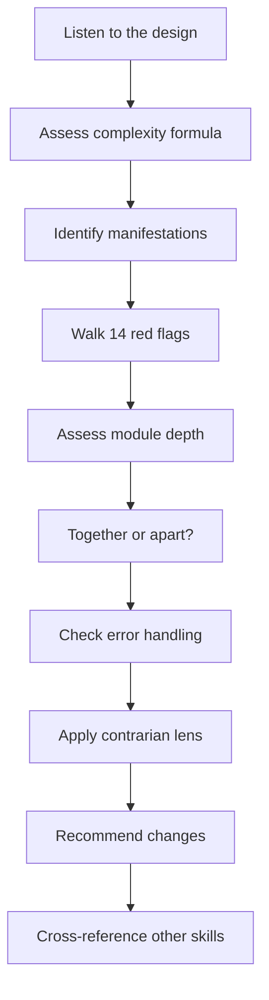
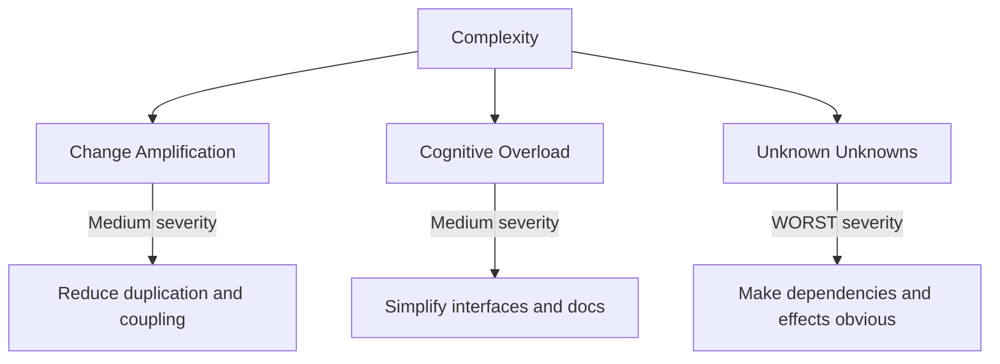
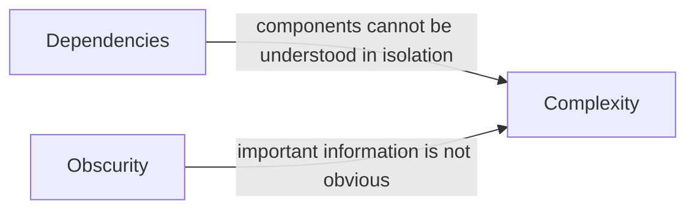
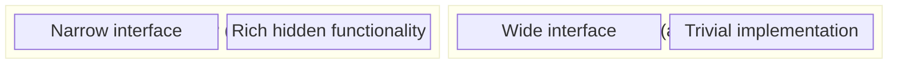
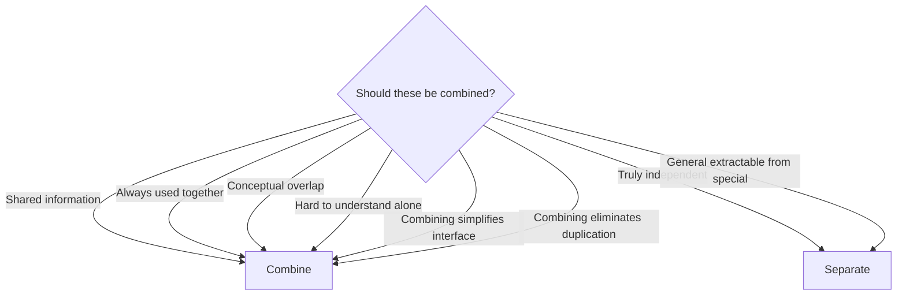
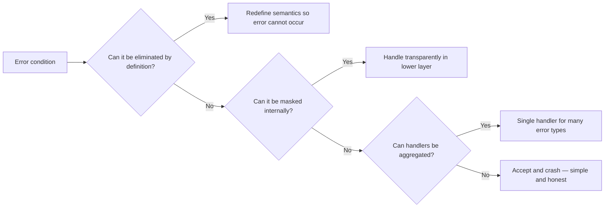
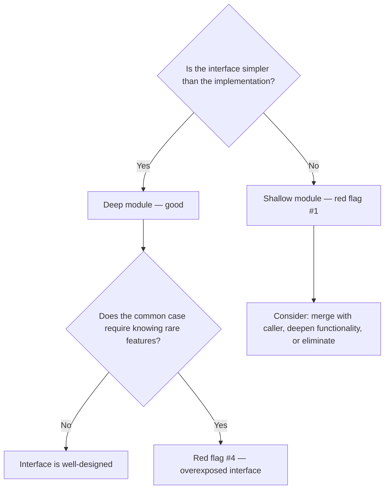
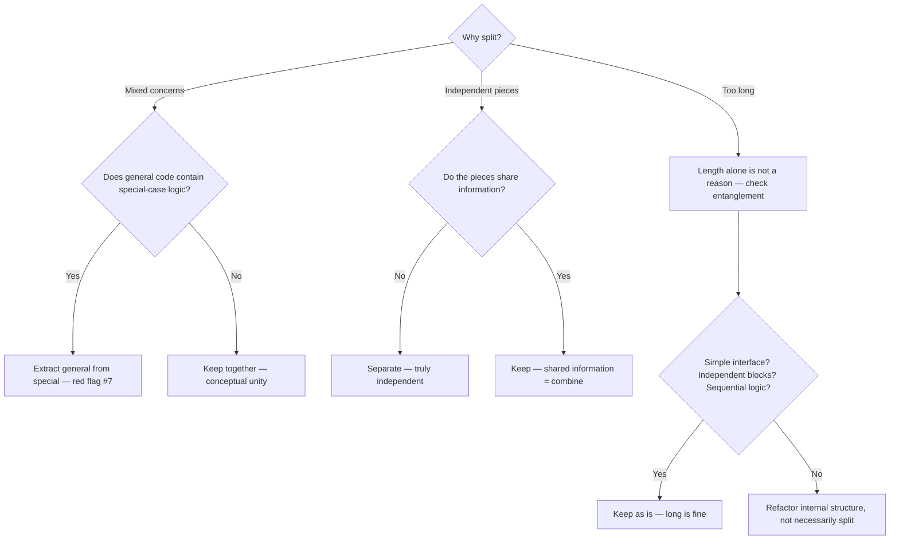
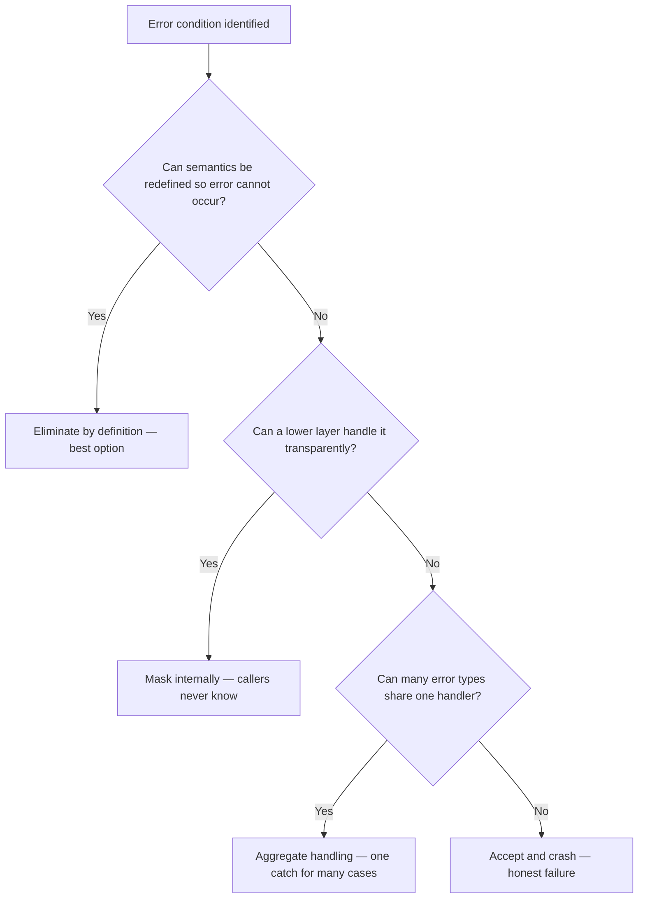
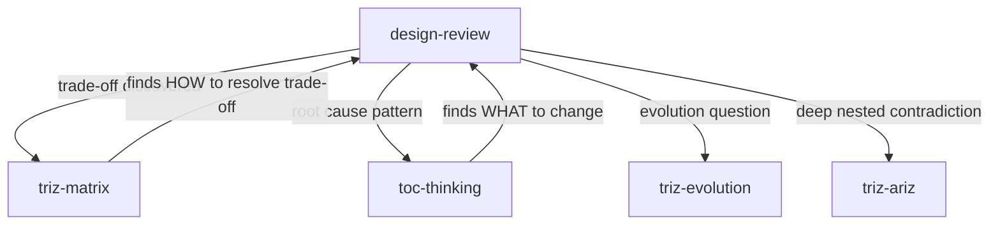

> ⚠️ **This README is for humans only.** LLM agents must NOT reference or load this file from SKILL.md. All instructions for the agent go in SKILL.md exclusively.

# Design Review — Complexity-Driven Analysis

**Evaluate and improve system designs by managing complexity.** Uses 14 red flags, 15 design principles, error elimination strategies, and deep-vs-shallow analysis derived from John Ousterhout's research (Stanford CS 190, *A Philosophy of Software Design*).

---

## TL;DR

All design problems reduce to managing complexity. Complexity has a formula (**C = Sum(cp * tp)**), three manifestations (change amplification, cognitive overload, unknown unknowns), and two root causes (dependencies, obscurity). This skill walks a 10-step review process using 14 red flags, 15 principles, depth analysis, together/apart criteria, error elimination strategies, and contrarian positions to produce specific, actionable recommendations.

---

## When to Use

- **Module/API/component design review** — is this abstraction the right one?
- **Refactoring decisions** — should I split or merge these modules?
- **Interface assessment** — does this interface hide the right things?
- **Naming difficulty** — struggling to name something clearly
- **Error handling sprawl** — Error Boundaries and try/catch blocks multiplying across the codebase
- **Layer similarity** — adjacent layers have nearly identical abstractions
- **"It feels tangled"** — entangled implementations, unclear boundaries

## When NOT to Use

- **Parameter trade-off** (bundle size vs features, render speed vs data freshness) — use `triz-matrix`
- **Root cause of recurring failures** — use `toc-thinking`
- **Architecture evolution direction** — use `triz-evolution`
- **Deep nested contradictions** — use `triz-ariz`
- **Implementation question** (which hook to use, which CSS approach) — no skill needed

---

## How It Works

### The 10-Step Review Process



### The Complexity Formula

```text
C = Sum(cp * tp)

cp = complexity of component p
tp = fraction of time spent working with component p
```

A highly complex component that nobody touches contributes almost nothing to overall system complexity. A mildly complex component that everyone modifies daily dominates the complexity budget. The implication: isolating complexity where developers rarely venture is nearly equivalent to eliminating it.

### Three Manifestations



### Two Root Causes



Every instance of complexity traces to one or both of these.

---

## Key Concepts

### Deep vs Shallow Modules

The central metaphor: a module is a rectangle. Width = interface complexity. Height = functionality depth.



**Deep**: simple interface, hides significant complexity. Callers benefit greatly from the abstraction.

**Shallow**: complex interface, trivial body. The cost of learning the interface exceeds the benefit of using it.

### Together or Apart?



**Key insight**: a long function is fine if it has a simple interface, independent blocks, and sequential logic. Splitting for length alone creates entanglement.

### Error Elimination Strategies



Priority flows left to right: eliminate > mask > aggregate > crash. Each step reduces caller complexity.

---

## Decision Trees

### Is This Abstraction Right?



### Should I Split This Module?



### How to Handle This Error?



---

## The 14 Red Flags (Quick Reference)

| # | Flag | What to Look For |
|---|------|-----------------|
| 1 | Shallow abstraction | Interface not simpler than what it hides |
| 2 | Leaked internals | Same decision in multiple modules |
| 3 | Temporal structure | Organized by execution order, not ownership |
| 4 | Interface overexposure | Common case needs rare-feature awareness |
| 5 | Pass-through delegation | Function only forwards to another |
| 6 | Repeated patterns | Same logic in multiple places |
| 7 | Mixed concerns | General mechanism has special-case logic |
| 8 | Entangled implementations | Must read function B to understand A |
| 9 | Redundant documentation | Comments restate obvious code |
| 10 | Leaked implementation in docs | API docs describe internals |
| 11 | Vague naming | Name could mean many things |
| 12 | Naming difficulty | Hard to name = unclear purpose |
| 13 | Description difficulty | Hard to describe = flawed design |
| 14 | Non-obvious behavior | If anyone says unclear, it IS unclear |

---

## The 15 Principles (Quick Reference)

| # | Principle | Core Idea |
|---|-----------|-----------|
| 1 | Complexity is incremental | Small shortcuts accumulate |
| 2 | Working code is not enough | Invest in design, not just function |
| 3 | Continuous investment | Every change = opportunity to improve |
| 4 | Deep modules | Simple interface, rich functionality |
| 5 | Common case simplicity | Frequent operations should be trivial |
| 6 | Simple interface > simple implementation | Absorb complexity, do not push it |
| 7 | General interfaces are deeper | Slightly general = simpler and more reusable |
| 8 | Separate general from special | Do not contaminate mechanisms with policy |
| 9 | Different layers, different abstractions | Similar adjacent layers = wrong decomposition |
| 10 | Pull complexity downward | Author absorbs, callers benefit |
| 11 | Eliminate errors by design | Redesign so errors cannot occur |
| 12 | Design it twice | Two radically different sketches, then compare |
| 13 | Document the non-obvious | Capture what code cannot express |
| 14 | Optimize for reading | Clarity over brevity |
| 15 | Abstractions over features | Discover abstractions, not checklists |

---

## Contrarian Positions

These challenge common practices that may increase complexity when applied mechanically:

1. **Short functions are not a goal** — splitting for length creates entanglement
2. **Code is not self-documenting** — rationale and constraints need comments
3. **Test-first can miss abstractions** — design discovery matters more than test coverage
4. **Many small classes = interface explosion** — consolidate where information is shared
5. **Defensive error handling adds complexity** — eliminate errors by design instead
6. **Getters/setters expose internals** — they violate information hiding
7. **Patterns are tools, not targets** — forcing them adds accidental complexity
8. **Implementation inheritance creates coupling** — prefer composition and information hiding

---

## Relationship to Other Skills



- **design-review** prescribes WHAT makes a good design
- **triz-matrix** resolves trade-offs between competing design qualities
- **toc-thinking** finds root causes when multiple design problems share a source
- **triz-evolution** assesses whether a design has growth potential or needs replacement
- **triz-ariz** handles deeply tangled problems that resist straightforward analysis

---

## How to Use

### Command: `/design-review`

Auto-detects what is being reviewed and guides through the 10-step process.

### Interactive Workflow

1. **Present the design** (module, API, architecture, refactoring plan)
2. **Claude assesses complexity** (formula, manifestations, root causes)
3. **Walk the red flags** (14-item checklist against your specific design)
4. **Depth and boundary analysis** (deep/shallow, together/apart)
5. **Error strategy review** (eliminate > mask > aggregate > crash)
6. **Contrarian check** (conventional wisdom that may not apply)
7. **Actionable recommendations** with rationale tied to principles

---

## Troubleshooting

### "Every module looks shallow."

Not every module needs to be deep. Utility functions, thin wrappers around browser APIs, and
configuration providers are naturally shallow. The red flag triggers when a module *claims* to
provide an abstraction but its interface is as complex as what it hides. Ask: does the caller
benefit from this indirection?

### "I can't decide whether to split or merge."

If you cannot articulate what information the two pieces share, they are probably independent --
separate them. If you cannot explain one piece without referencing the other, they are entangled --
combine them. When in doubt, combine: merging later is harder than splitting.

### "The contrarian positions contradict my team's coding standards."

These positions are design heuristics, not absolute rules. They identify cases where common
practices *may* increase complexity. If your team has a standard (e.g., max function length),
the skill's job is to flag cases where following it mechanically may be counterproductive.
Discuss with the team -- the goal is lower complexity, not rule adherence.

### "The review found no red flags but the design still feels wrong."

Check the complexity formula. The design may be fine structurally but concentrated in a
high-tp area (frequently modified). Consider whether the module boundaries match the actual
change patterns. Also check for unknown unknowns -- they are the hardest manifestation to
detect because by definition you do not know what you are missing.

---

## Further Reading

- John Ousterhout, *A Philosophy of Software Design* (2nd ed., 2021) — primary source
- John Ousterhout, Stanford CS 190 course materials
- Fred Brooks, *The Mythical Man-Month* (1975) — complexity scaling in large systems
- David Parnas, "On the Criteria To Be Used in Decomposing Systems into Modules" (1972) — information hiding

---

**Framework:** Ousterhout's complexity management principles (Stanford CS 190)
**No external dependencies.**
