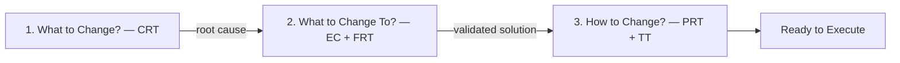
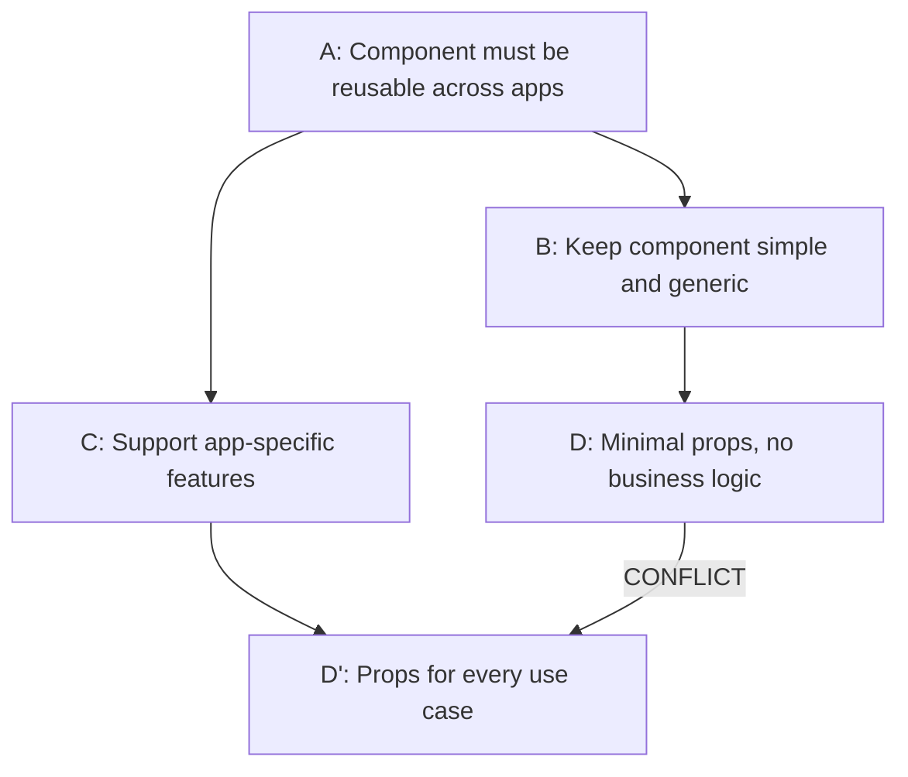
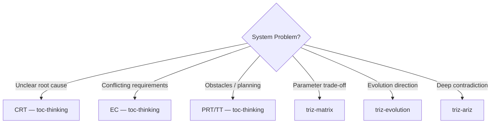

> ⚠️ **This README is for humans only.** LLM agents must NOT reference or load this file from SKILL.md. All instructions for the agent go in SKILL.md exclusively.

# TOC Thinking for Code & Architecture

Goldratt's Theory of Constraints applied to debugging, UI architecture decisions, and frontend system failures.

A root-cause analysis and conflict-resolution toolkit for tracing cascading UI failures to their source, resolving component architecture dilemmas, and planning refactoring migrations that actually work.

---

## What This Skill Does

This skill applies five logical thinking tools from Theory of Constraints to code and architecture problems:

1. **Trace symptoms to root cause** (CRT — Current Reality Tree) — Why does the meeting room component keep re-rendering? Follow the causal chain to unnormalized Redux state, not the symptom.
2. **Resolve architectural dilemmas** (EC — Evaporating Cloud) — Component must be reusable AND feature-rich. Find the false assumption blocking both.
3. **Validate refactoring before shipping** (FRT — Future Reality Tree) — Will extracting this component into rcv-ui actually fix the coupling?
4. **Identify migration obstacles** (PRT — Prerequisite Tree) — What blocks migrating from class components to hooks?
5. **Plan phased implementation** (TT — Transition Tree) — TypeScript types → new selectors → refactor connected components. In what order?

All reasoning is validated against 8 CLR (Categories of Legitimate Reservation) rules — a logical checklist that exposes false cause-effect chains.

---

## When to Use TOC Thinking

### Use This Skill When

- **Cascading failures with unclear root cause**: Component A re-renders → triggers cascade re-render in B → causes layout thrashing in C. What's the real bottleneck?
- **Architectural dilemmas**: Keeping state in Redux (predictable) requires boilerplate, but local state (simple) breaks shared access. How do we have both?
- **System failures repeating in same subsystem**: Memory leaks in the same component, cascade re-renders at the same point, bugs in the same UI domain.
- **Planning data model or bounded context migrations**: Moving from monolithic vc-web components to shared rcv-ui library — what obstacles will we hit?
- **Validating proposed refactorings**: Before investing weeks extracting a shared component, will it actually fix the problem or just move the coupling?

### Don't Use This Skill When

- **Technical parameter trade-off** (bundle size vs feature richness, render speed vs data freshness) → use `triz-matrix`
- **"Where should this architecture go?"** (class components → hooks? Redux → context?) → use `triz-evolution`
- **Deep multi-layered contradictions** (complex circularity) → use `triz-ariz`

---

## How It Works: The Three-Question Framework

TOC answers three core questions:



---

## The Five Tools

### 1. Current Reality Tree (CRT) — Find Root Cause

**Question:** What is the actual root cause of these symptoms?

**How it works:** Map system problems (Undesirable Effects) and trace cause-effect chains backward to find the single constraint causing multiple failures.

#### Example: Meeting Room UI Freezes

```text
UDE: Meeting room UI freezes when participant list updates
    ↑ caused by
Entire participant grid re-renders on any change
    ↑ caused by
ParticipantList selector returns new array reference on every call
    ↑ caused by
Selector creates new derived objects inside map()
    ↑ caused by (ROOT CAUSE)
Selector is not memoized and lacks structural sharing
```

**Output:** The constraint to fix — address this, and multiple symptoms disappear.

---

### 2. Evaporating Cloud (EC) — Resolve Architectural Dilemmas

**Question:** How do we break an architectural deadlock?

**Structure:** A 5-element logical conflict:



**How it works:**

1. **List hidden assumptions** (Why does reusability require minimal props? Because we thought more props means more coupling. Is it?)
2. **Challenge them** — which is actually false or context-dependent?
3. **Inject a solution** that breaks the conflict (e.g., composition with render props → component is simple AND feature-rich)

**Code example:**

```typescript
// Assumption: Reusable component needs props for every feature
// WRONG. Inject: composition with render props / children

<ParticipantTile
  participant={participant}
  renderActions={(p) => <MeetingActions participant={p} />}
/>
```

---

### 3. Future Reality Tree (FRT) — Validate Refactoring Plans

**Question:** If we implement this solution, will it actually fix the problem?

**How it works:** Trace the solution forward through cause-effect chains to verify:

- Does it eliminate the root cause?
- Does it break the conflict?
- Does it create new problems?

**Example:** "We'll extract ParticipantGrid into rcv-ui"

- Claim: Reduces coupling in vc-web meeting components
- Check: Does it? Or does rcv-ui now depend on meeting-specific Redux state?
- New risk: Prop drilling instead of Redux connect — is that better?

**Output:** Confidence in the refactoring before shipping it.

---

### 4. Prerequisite Tree (PRT) — Identify Migration Obstacles

**Question:** What must be true before we can make this change?

**How it works:** Work backward from the goal, identifying intermediate conditions (Prerequisites) and obstacles blocking each one.

#### Example: Migrate class components to functional components with hooks

```text
Goal: All vc-web components use hooks
  ← Prerequisite: Shared logic extracted into custom hooks
      ← Obstacle: Business logic tightly coupled to componentDidMount/componentDidUpdate
          Countermeasure: Map lifecycle methods to useEffect patterns
      ← Obstacle: HOC chains (connect, withTranslation, withRouter) hard to convert
          Countermeasure: Replace HOCs one at a time, useSelector/useDispatch/useTranslation
  ← Prerequisite: Tests updated for hook components
      ← Obstacle: 120+ enzyme tests use .instance() and .state()
          Countermeasure: Migrate to React Testing Library, test behavior not implementation
      ← Obstacle: Snapshot tests break on structure changes
          Countermeasure: Replace snapshots with targeted assertions
```

**Output:** Clear blockers and their solutions — tackle in dependency order.

---

### 5. Transition Tree (TT) — Plan Phased Implementation

**Question:** What are the implementation steps and their sequence?

**How it works:** Specify actions, outcomes, and prerequisites in execution order. Identify what must be true before each step.

#### Example: Class components to hooks migration rollout

```text
Step 1: Create custom hooks for shared logic
  Prerequisite: Common patterns identified across components
  Outcome: useParticipant, useMeeting, useMediaStream hooks created

Step 2: Convert leaf components first (no children depending on them)
  Prerequisite: Custom hooks available and tested
  Outcome: Simple components like StatusIndicator, MuteButton converted

Step 3: Convert container components, replace connect() with useSelector/useDispatch
  Prerequisite: Leaf components stable with hooks
  Outcome: ParticipantTile, ChatPanel converted

Step 4: Remove legacy HOC wrappers and enzyme tests
  Prerequisite: All components converted and RTL tests passing
  Outcome: Clean codebase, no class component patterns
```

**Output:** A sequence that reduces risk — test each step before the next.

---

## Logical Validation: The 8 CLR Rules

Every cause-effect statement is validated against these 8 rules:

| Rule | Check | Example |
|------|-------|---------|
| **Clarity** | Is the statement unambiguous? | ❌ "Process is slow" → ✓ "Deployment takes 45 min" |
| **Entity Existence** | Do the entities actually exist? | ❌ "Non-existent module fails" → ✓ "Redis connection pool runs out" |
| **Causality Existence** | Is there a real cause-effect link? | ❌ "Code review delays features" (reviews prevent bugs, which delays less overall) |
| **Cause Sufficiency** | Does the cause ALWAYS produce the effect? | ❌ "Bugs exist because code is complex" (also needs: no tests) |
| **Additional Cause** | Are there OTHER necessary causes? | ❌ "Deploys fail" (missing: what else? timing? load?) |
| **Cause-Effect Reversal** | Is the direction correct? | ❌ "Tech debt causes feature requests" → ✓ "Ignoring tech debt enables more feature requests" |
| **Predicted Effect** | Does the effect match predictions? | ❌ "Code review reduces bugs by 80%" (check actual data) |
| **Tautology** | Is it circular logic? | ❌ "Bugs exist because there are bugs" |

---

## Real-World Examples

### Example 1: "Why Does the Meeting Room UI Keep Freezing?"

```text
UDE: Meeting room UI stutters when 25+ participants join
    ↑ caused by
Full ParticipantGrid re-render on every participant status change
    ↑ caused by
Redux selector returns new object references on every call
    ↑ AND caused by
ParticipantTile not wrapped in React.memo
    ↑ caused by (ROOT CAUSE)
Selector uses Array.map() without memoization, creating new objects every render cycle
```

**Root cause:** Selector creates new derived objects on every call. The constraint is selector memoization, not component complexity.

**Solution:** Use createSelector (reselect) for memoized selectors + React.memo on ParticipantTile.

---

### Example 2: "Component Reusability vs Feature Richness Dilemma"

```text
              ┌── Keep component generic ── Minimal props, no business logic
  Reusable ───┤                             ↕ conflict
  component   └── Support all use cases ── Props for every feature
```

**Assumptions:**

- A→B: Reusability means minimal props → False if you use composition patterns
- B→D: Minimal props means no customization possible
- A→C: Feature support requires explicit props → False if you use render props / children
- C→D': Every use case needs a dedicated prop

**Challenge assumption:** Does every feature need a prop, or can we compose behavior through children and render props?

**Injection:** Composition pattern with slots

```typescript
// Before: 15 boolean props controlling every behavior
<Button primary secondary outlined disabled loading small large icon />

// After: Composition + variants
<Button variant="primary" size="large">
  {loading ? <Spinner /> : <Icon name="call" />}
  Join Meeting
</Button>
```

Result: Simple component API AND full feature support through composition.

---

### Example 3: "Planning Class Components → Hooks Migration in vc-web"

```text
Goal: All vc-web meeting components use hooks
  ← Prerequisite: Shared lifecycle logic extracted into custom hooks
      ← Obstacle: componentDidMount/componentDidUpdate contain business logic
          Countermeasure: Map lifecycle patterns to useEffect with proper dependency arrays
  ← Prerequisite: HOC chains replaced with hooks equivalents
      ← Obstacle: connect() + withTranslation + withRouter deeply nested
          Countermeasure: Replace one HOC at a time: useSelector, useTranslation, useNavigate
  ← Prerequisite: Test infrastructure supports hook components
      ← Obstacle: Enzyme .instance() and .state() calls throughout test suite
          Countermeasure: Migrate to React Testing Library, test user-visible behavior
```

**Transition steps (order matters):**

1. Create custom hooks for common patterns (useParticipant, useMeeting, useMediaStream)
2. Convert leaf components (StatusIndicator, MuteButton) — no dependents to break
3. Convert container components, replace connect() with useSelector/useDispatch
4. Migrate enzyme tests to React Testing Library as each component converts
5. Remove legacy HOC wrappers and class component utilities
6. Clean up unused lifecycle-related helper functions

---

## Decision Tree: Which Problem-Solving Tool?



---

## How to Use the Skill

### Command: `/toc-thinking`

Auto-detects your problem type and guides you through the appropriate tool(s).

### Interactive Workflow

1. **Describe the problem** (e.g., "ParticipantGrid re-renders cascade to child components")
2. **Claude runs the appropriate tool** (CRT for root cause, EC for conflicts, PRT for obstacles)
3. **Review the analysis** (cause chains, conflict structure, prerequisite graph, phased plan)
4. **Challenge assumptions** (Is that link really causal? What breaks the assumed dependency?)
5. **Refine** until you have a testable hypothesis and implementation roadmap

---

## When NOT to Use This

- **Single technical question** ("Should I use useMemo here?") → Use documentation or experiment
- **Implementation detail** ("How do I type this component's props?") → Use your IDE
- **Parameter trade-off** (bundle size vs feature count, render speed vs data freshness) → Use `triz-matrix`
- **Architecture evolution** ("Should we migrate from Redux to Zustand?") → Use `triz-evolution`

---

## When TOC Thinking Works Best

1. **Multiple cascading re-renders** with no obvious single cause
2. **Component architecture dilemmas** where every solution creates new prop drilling
3. **Large component refactorings** where you need to identify obstacles before investing months
4. **Root-cause analysis** that goes deeper than "just add React.memo"

The output is a rigorous logical map of cause-effect relationships, validated against CLR rules. This forces clear thinking and reveals hidden assumptions that block progress.

---

## Further Reading

- **Goldratt, E. M.** *The Goal* — Foundation: Theory of Constraints
- **Dettmer, H. W.** *Goldratt's Theory of Constraints: A Systems Approach* — Detailed reference

---

**Theory:** Goldratt's Theory of Constraints Thinking Processes
**Tools included:** CRT, EC, FRT, PRT, TT + 8 CLR validation rules
