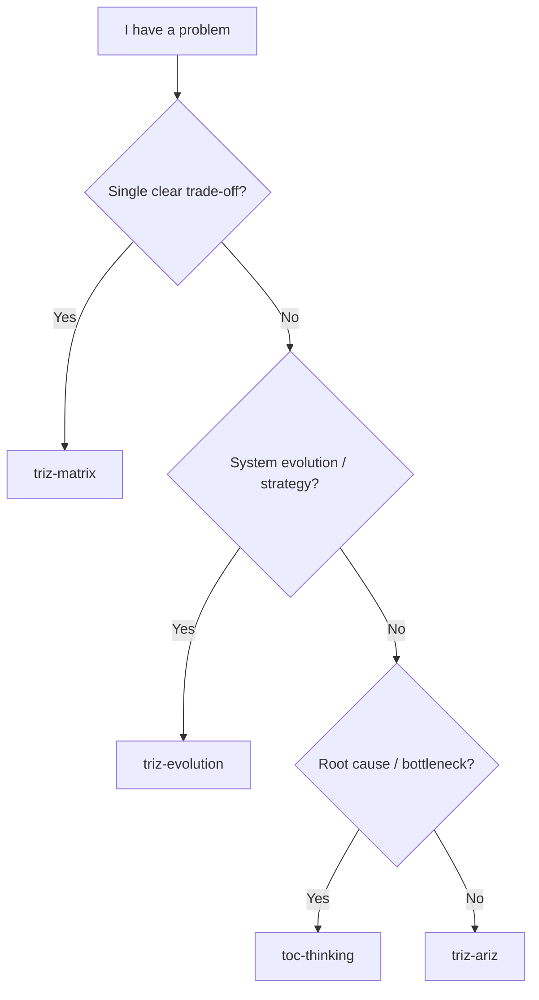
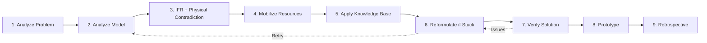

> ⚠️ **This README is for humans only.** LLM agents must NOT reference or load this file from SKILL.md. All instructions for the agent go in SKILL.md exclusively.

# ARIZ-85C: The Full Algorithm of Inventive Problem Solving

For frontend engineers working on complex, multi-layered UI architecture problems.

ARIZ-85C is the heavy-duty TRIZ methodology — a systematic, 9-part algorithm for solving problems that involve multiple intertwined contradictions, systemic issues, and deep technical conflicts where simple rules and quick fixes don't work.

This README explains **what** ARIZ does, **when** to use it, **how** it works mechanically, and **real examples** from software architecture.

---

## TL;DR

**Use this skill when:**

- The contradiction matrix (simple trade-offs) didn't yield satisfying results
- Multiple contradictions are entangled (fixing one breaks another)
- The problem spans multiple components and their interactions
- You need to understand **why** something is broken, not just patch it
- A physical contradiction is present (element must be X AND not-X simultaneously)

**Don't use this skill when:**

- You have a single, clear trade-off → use `triz-matrix` instead
- You're asking where the system should evolve → use `triz-evolution` instead
- You need a quick root-cause analysis → use `toc-thinking` instead

**Time investment:** 1–2 hours of systematic analysis per problem.

---

## What Is ARIZ-85C?

ARIZ stands for **Algorithm of Inventive Problem Solving** (from the Russian "Алгоритм Решения Изобретательских Задач"). The "85" denotes the 1985 refinement, and "C" is the complete version.

ARIZ is a **9-part structured dialogue** between you (the problem-solver) and Claude, where:

1. You describe a complex, vague problem
2. Claude asks sharp questions at each step
3. You reformulate the problem to reveal hidden contradictions
4. Together, you identify resources and apply proven solution patterns
5. You arrive at a novel, non-obvious solution

**Key insight:** Most of the value comes from *how you articulate the problem*, not from a magic formula. ARIZ forces clarity.

---

## When to Use ARIZ vs. Other Tools



### ARIZ: The Deep-Dive Scenarios

| Scenario | Use ARIZ? | Why |
|----------|-----------|-----|
| **Component reusability vs. feature specificity** | Yes | Multiple contradictions, system-level trade-off |
| **Legacy class components migration to hooks** | Yes | Intertwined dependencies, breaking changes ripple |
| **Cross-package state consistency (vc-web, librct, rcv-ui)** | Yes | Multiple packages in conflict over data ownership |
| **Render performance vs. data freshness dilemma** | Yes | Forced physical contradiction in real-time UI |
| **Component API (props) versioning deadlock** | Yes | Changing props API breaks consumers; keeping old API blocks new features |
| **Bundle size vs. feature richness** | No (matrix) | Single clear trade-off |
| **Should we migrate to Next.js?** | No (evolution) | Strategic question, not a contradiction |
| **Webpack build too slow** | No (toc) | Find the slowest stage, not contradictions |

---

## The ARIZ-85C Process: 9 Parts at a Glance



**Typical flow:**

- Parts 1–3: Problem articulation (20–30 min) — "What exactly is broken?"
- Parts 4–5: Solution synthesis (30–40 min) — "What can we do about it?"
- Parts 6–7: Verification (15 min) — "Will this work? What breaks?"
- Parts 8–9: Action (30+ min) — Prototype, measure, learn

---

## Key Concepts

### 1. Technical vs. Physical Contradiction

**Technical Contradiction:** "If I improve X, Y gets worse."

- Example: "If I add more memoization (better render performance), component complexity increases (worse maintainability)."
- Trade-off. Solvable by matrix.

**Physical Contradiction:** "Element Z must have property A AND must have property NOT-A."

- Example: "Component must RE-RENDER (to show fresh data) AND must NOT RE-RENDER (to stay performant)."
- Paradoxical. Requires ARIZ.

ARIZ resolves physical contradictions using **separation principles:**

| Separation | Meaning | Software Example |
|-----------|---------|-----------------|
| **In time** | Different properties at different moments | Component re-renders on interaction, skips re-render when idle |
| **In space** | Different properties at different locations | Visible components render fully; off-screen components are virtualized |
| **By condition** | Different properties under different circumstances | Use detailed view for active participant; use lightweight tile for others |
| **Between whole and parts** | Whole system is complex, parts are simple | App has complex state; individual components are simple and focused |

### 2. Substance-Field (Vepole) Analysis

Every system can be modeled as **S1 ← F → S2** (two substances connected by a field):

```text
    S1 (Tool/Actor)
      ↓
      F (Field: Protocol, API, Event, Dependency)
      ↓
    S2 (Object/Patient)
```

**Software mapping:**

| TRIZ Term | Software Example | Real Instance |
|-----------|-----------------|---------------|
| **S1 (Substance 1)** | React component, custom hook, Redux store | ParticipantGrid component |
| **F (Field)** | Props, Redux actions, context | Props passed, action dispatched, context consumed |
| **S2 (Substance 2)** | Child component, DOM, browser API | VideoTile component |
| **Complete vepole** | S1 -[F]-> S2: interaction exists | Container -[props]-> Component |
| **Incomplete vepole** | S1 . . . S2: should interact but don't | Component should react to Redux state changes but doesn't |
| **Harmful vepole** | S1 -[harmful F]-> S2: tight coupling | Component -[direct DOM manipulation]-> DOM (bypasses React) |

ARIZ includes **12 standard vepole patterns** for fixing broken interactions:

| # | Pattern | Action |
|---|---------|--------|
| 1 | Incomplete Vepole | Add a field to complete interaction |
| 2 | Harmful Interaction | Insert intermediary |
| 3 | Insufficient Action | Amplify the field |
| 4 | Bi-System Formation | Add a second substance |
| 5 | Transition to Supersystem | Connect to higher-level system |
| 6 | Transition to Micro | Work at finer granularity |
| 7 | Using Waste | Leverage unused resources |
| 8 | Combining Functions | Merge roles to simplify |
| 9 | De-coupling | Separate tightly-coupled substances |
| 10 | Matching | Align properties of both substances |
| 11 | Asymmetric Vepole | Different rules for S1 and S2 |
| 12 | Transition to Ideal | Let substances manage themselves |

### 3. Ideal Final Result (IFR)

The IFR describes a state where the contradiction doesn't exist — the system provides the desired function without harm and without complicating things.

**Example (render performance problem):**

- Broken IFR: "The component magically renders only what changed without any memoization logic."
- Better IFR: "React's reconciler automatically skips unchanged subtrees with zero developer effort."
- Practical IFR: "Virtualized list with windowing + React.memo + memoized selectors."

IFRs are *aspirational* but *functional*. They point toward innovation.

### 4. The X-Element

The **X-element** is the third thing (not the tool, not the object) that resolves the contradiction.

**Render performance example:**

- Tool: Component render logic
- Object: Redux store
- X-element: Memoized selector, React.memo wrapper, or virtualization library

Finding the X-element is **Part 3** of ARIZ. It's usually:

- A new component (wrapper, provider, adapter)
- A new interaction pattern (hooks, context, event bus)
- A new data structure (normalized store shape, memoized selectors, derived state)

---

## How to Use This Skill: Practical Workflow

### Trigger the Skill

In Claude Code, Codex, or Cowork, use `/triz-ariz` or describe your problem:

```text
"We're migrating 200+ class components to hooks in vc-web, but every time we convert
a container, its children break because they depend on HOC-injected props. We've been
stuck for 3 weeks. The team is frustrated that partial conversions just move the problem elsewhere."
```

Claude will recognize this as a multi-layered contradiction problem and launch ARIZ.

### Follow the Dialogue

Claude will guide you through **9 parts systematically**. At each step:

1. **Claude asks sharp questions** — not vague, but targeted
2. **You articulate the problem** — refine your understanding
3. **Claude documents findings** — contradiction, resources, solutions
4. **You propose next steps** — prototype, measure, iterate

### Example: Legacy Class Components to Hooks Migration

Let's walk through a real scenario:

#### Part 1: Analyze the Problem

**Claude asks:**
> "Let's start with the mini-problem. Your vc-web package has 200+ class components with complex HOC chains (connect, withTranslation, withRouter). You want to convert them to hooks for better composability and testing, but each conversion breaks something. What exactly is the first thing that breaks?"

**You respond:**
> "When we convert the MeetingContainer from a class to a functional component with hooks, all its children still expect HOC-injected props. The children are wrapped with connect() and withTranslation(), and they rely on the parent's HOC chain for context. We can't convert the parent without converting the children, but converting children first breaks because they still live inside the old HOC wrappers."

**Claude documents:**

```text
Mini-problem: vc-web (200+ class components, deep HOC chains: connect, withTranslation, withRouter)
Purpose: Migrate to hooks for better composability, testing, and code reuse
Shortcoming: Each conversion breaks dependent components in the HOC chain
Conflicting pair: (Hooks for new patterns) ↔ (HOC chain compatibility for existing components)
```

#### Part 2: Analyze the Problem Model

**Claude asks:**
> "When exactly does the breaking happen? At the component boundary when you convert a container? During prop drilling? Or when HOC wrappers expect class lifecycle methods?"

**You respond:**
> "At the component boundary. When we convert a container from class to hooks, its children still expect HOC-injected props via connect(). We can't mix hooks and HOCs in the same component — you can't call useSelector inside a component that's already wrapped with connect(). And we can't convert incrementally because the HOC chain is tightly coupled top-to-bottom."

**Claude documents:**

```text
Operative zone: Component composition layer (HOC chain boundaries)
Operative time: Migration transition (old HOC-based components ↔ new hook-based components coexisting)
Physical contradiction: Component must use class lifecycle (for existing HOC chain) AND must use hooks (for new patterns)
```

#### Part 3: Identify IFR and X-Element

**Claude asks:**
> "If it were perfect, how would each component independently use hooks or HOCs without affecting its neighbors?"

**You respond:**
> "Each component would just work — hooks internally, but still compatible with parent HOC chains. Like... the boundary would be transparent, or there'd be an adapter that bridges the two worlds."

**Claude identifies X-element:**
> "The X-element is an **adapter hook or bridge pattern** — a wrapper that exposes HOC-compatible interfaces externally while using hooks internally. Or alternatively, **hook equivalents** for each HOC that can be used incrementally without breaking the chain."

#### Part 4: Mobilize Resources

**Claude asks:**
> "What internal and external resources do you have?"

**You respond:**

```text
Internal:
- Redux store (already centralized in rwc-redux)
- Custom hooks in rwc-utils (some already exist)
- React Testing Library (for verifying conversions)
- Feature flags system (for gradual rollout)
- Storybook (for visual regression testing)
- Team of 4 frontend engineers

External:
- React 17 (supports both classes and hooks)
- TypeScript (type safety during migration)
- Jest (unit testing)
```

#### Part 5: Apply TRIZ Knowledge Base

**Claude applies principles:**

- **Principle 3 (Extraction)**: Extract HOC logic into equivalent hooks (useAppSelector, useAppDispatch, useAppTranslation)
- **Principle 10 (Prior action)**: Create hook equivalents before converting any components
- **Principle 15 (Dynamization)**: Use feature flags to toggle between HOC and hook implementations per component family
- **Principle 28 (Replacement)**: Replace connect() with useSelector/useDispatch, withTranslation with useTranslation
- **Vepole Pattern 2 (Harmful -> Intermediary)**: Insert adapter wrappers between hook-based and HOC-based components

**Solution emerges:**

```text
1. Create hook equivalents for each HOC (useAppSelector, useAppDispatch, useAppTranslation)
2. Convert leaf components first (no HOC chains depending on them)
3. Use adapter pattern: wrap hook-based components to expose HOC-compatible interface
4. Feature flag per component family to toggle implementations
5. Gradually convert container components bottom-up
6. Remove old HOC wrappers once all consumers are migrated
```

#### Part 7: Verify Solution

**Claude checks:**

- Resolves the contradiction? Yes, components can use hooks or HOCs independently
- Secondary contradictions? Yes, introduces temporary adapter overhead and duplicate code paths
- Resource requirements? Testing effort, Storybook updates, feature flag management
- Worth it? Yes, unlocks hooks ecosystem and improves testability long-term

#### Part 8: Prototype & Measure

**You implement:**

- Convert one small leaf component family (e.g., meeting footer buttons) first
- Measure: bundle size delta, test coverage, render performance, developer velocity
- If metrics are acceptable, expand to next component family

#### Part 9: Retrospective

**Lessons learned:**

- The real problem wasn't hooks vs. classes; it was the tight coupling in HOC chains
- ARIZ forced us to identify the X-element (adapter pattern + hook equivalents) earlier
- We avoided three months of big-bang rewrite before realizing incremental migration was possible

---

## Red Flags & Gotchas

### ⚠️ Problem Statement Still Vague After Part 1

If you finish Part 1 and the contradiction is still fuzzy, **don't proceed**. Re-articulate until both you and Claude agree on:

- What the system does
- What's broken
- What two things are in conflict

Vague problems yield vague solutions.

### ⚠️ Multiple Contradictions Identified

**This is expected and good** — ARIZ is designed for entangled contradictions. Focus on the main one first; secondary ones often resolve as side effects or become mini-ARIZ subproblems.

### ⚠️ Solution Introduces New Unsolved Contradictions

**Normal.** Document them and decide: Are they acceptable? Can we solve them in a follow-up iteration? Do they point to a different X-element?

### ⚠️ 1–2 Hour Estimates Are Accurate

Don't rush ARIZ. If you're trying to compress it into 15 minutes, the solution will be shallow. Budget the time; results justify it.

---

## Integration with Other TRIZ Skills

You have three TRIZ skills available:

```text
┌─────────────────────────────────────────────────────────────────┐
│ triz-matrix        Simple trade-offs → 40 inventive principles  │
│ triz-evolution     System evolution → avoid dead ends            │
│ triz-ariz          Multi-layered contradictions → full algorithm │
└─────────────────────────────────────────────────────────────────┘
```

**Typical workflow:**

1. **triz-matrix first** — Try the contradiction matrix if the trade-off is clear
2. **If matrix isn't enough** → escalate to **triz-ariz**
3. **After solving** → use **triz-evolution** to plan long-term strategy

**Example:** You have a render performance problem in the participant grid.

- Matrix might suggest: "Use React.memo and memoized selectors" (Principle 28)
- If implementation is tricky and multiple packages are involved (vc-web, librct, rcv-ui) → ARIZ
- After ARIZ solution is deployed → Use evolution to plan how the rendering architecture should grow over 2 years

---

## Real-World Examples

### Example 1: Legacy Class Components to Hooks Migration

**Problem:** 200+ class components in vc-web with deep HOC chains (connect, withTranslation, withRouter). Every conversion breaks dependent components in the chain.

**ARIZ applied:** Identified X-element (adapter pattern + hook equivalents), used vepole patterns to decouple HOC dependencies, resulted in bottom-up incremental migration with feature flags.

**Time:** 2 hours of analysis, 2 weeks of implementation, avoided 3 months of big-bang rewrite.

### Example 2: Render Performance vs. Data Freshness in Participant Grid

**Problem:** Grid must update immediately when participants change (fresh data), but re-rendering 50+ video tiles is expensive (performance). Physical contradiction: component must re-render (fresh data) AND must NOT re-render (performance).

**ARIZ applied:** Identified physical contradiction, used separation-in-space (virtualize off-screen tiles), separation-in-time (batch updates with requestAnimationFrame), applied vepole pattern to introduce memoized selector layer.

**Time:** 1.5 hours of analysis, resulted in hybrid virtualization + batching model.

### Example 3: rcv-ui Component API Evolution

**Problem:** Button v1 has `primary`/`secondary` boolean props; v2 needs `variant` enum; consumers across vc-web can't all migrate at once; maintaining both APIs is a maintenance nightmare.

**ARIZ applied:** Identified X-element (props adapter layer), used principle of transition (v1 props auto-mapped to v2 internally), applied vepole pattern 11 (asymmetric: old consumers use adapter, new consumers use native v2 API).

**Time:** 1 hour of analysis, 3-day implementation, zero breaking changes.

---

## When ARIZ Might Not Be Enough

- **If the problem is fundamentally under-specified:** ARIZ forces clarity, but if you don't know what success looks like, no algorithm helps
- **If the team can't commit 1–2 hours:** ARIZ works best with dedicated focus; task-switching breaks the dialogue
- **If the domain is unfamiliar:** ARIZ assumes you know the system well enough to identify resources and effects. For unfamiliar packages or libraries, start with codebase exploration first

In these cases, use ARIZ as a *framework for thinking*, not a guarantee.

---

## Next Steps

1. **Invoke the skill** using `/triz-ariz` or describe your problem
2. **Be prepared for Part 1** — come with a detailed problem description (not vague intuitions)
3. **Follow Claude's questions** — don't skip steps; articulation is the value
4. **Document findings** — take notes at each part (Claude will too)
5. **Prototype quickly** — don't over-engineer based on ARIZ alone
6. **Measure and iterate** — verify the solution works before full rollout

---

## Questions & Limitations

**Q: What if ARIZ suggests something impractical?**
A: ARIZ identifies the logically *optimal* solution given the contradiction. Practicality (cost, effort, risk) is Part 7. Document trade-offs and decide together.

**Q: Can I use ARIZ for non-software problems?**
A: Yes. ARIZ was invented for hardware (mechanical systems). Software is just a new domain. Adapt the examples to your field.

**Q: How is ARIZ different from root-cause analysis?**
A: Root-cause analysis finds *why* something broke. ARIZ finds *how to resolve the contradiction that caused it*. Different tools for different goals.

**Q: Can I run ARIZ asynchronously (across multiple sessions)?**
A: Yes, but momentum matters. Ideally, Parts 1–5 in one sitting. Parts 6–9 can be separate if needed.

---

## References

- **Original source:** G. Altshuller, "And Suddenly the Inventor Appeared" (1984)
- **ARIZ-85C methodology:** All 9 parts with step templates inlined in SKILL.md
- **Substance-Field patterns:** 12 vepole patterns with descriptions inlined in SKILL.md

---

**Version:** 1.0
