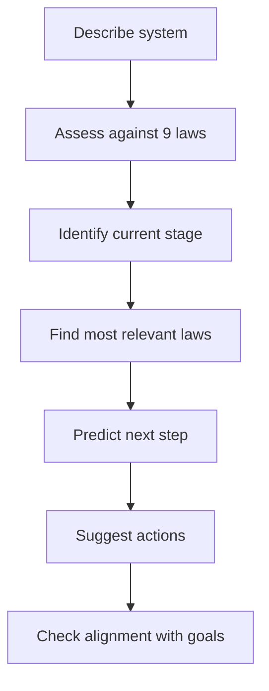
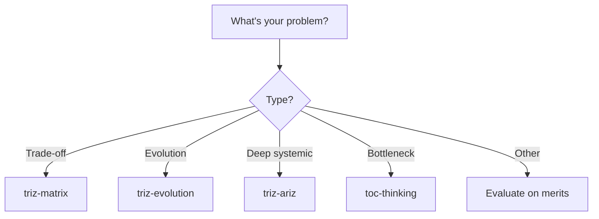

> ⚠️ **This README is for humans only.** LLM agents must NOT reference or load this file from SKILL.md. All instructions for the agent go in SKILL.md exclusively.

# TRIZ Laws of Technical System Evolution

A skill for predicting where your system, architecture, or product should evolve next based on universal evolution patterns discovered by Genrich Altshuller.

## Overview

**What it does:** Analyzes your current system against 9 universal laws of technical evolution and 8 cross-cutting patterns to predict the next evolution step and suggest concrete actions.

**Why it matters:** System evolution is not random. Altshuller's laws reveal patterns discovered across thousands of patents—architectural decisions that "feel right" often follow these laws unconsciously. Making the patterns explicit helps you:

- Avoid dead-end evolutionary paths
- Identify bottleneck subsystems before they become critical
- Plan technology roadmaps with confidence
- Modernize legacy systems systematically

**Who should use it:** Frontend architects, tech leads, and senior engineers making decisions about UI architecture evolution, technology roadmaps, or long-term design strategy.

---

## When to Use This Skill

### ✅ Good Use Cases

- **"Where should this architecture go next?"** — assess maturity, identify evolution direction
- **"Is our current design approach sustainable?"** — check for stalled evolution or misalignment
- **"How should we modernize this legacy system?"** — plan multi-phase evolution
- **"What's the next iteration of our deployment pipeline?"** — roadmap evolution steps
- **"Our component library keeps growing — when should we refactor?"** — detect subsystem evolution friction
- **"Should we move from monolithic vc-web to micro-frontends?"** — transition analysis (transition to super-system law)
- **"Our Redux store is becoming a bottleneck. What's the evolution path?"** — identify next architectural step

### ❌ Not the Right Skill For

- **Specific parameter trade-off** ("bundle size vs. feature richness") → use **triz-matrix**
- **Deep systemic multi-layer problem** (nested contradictions across domains) → use **triz-ariz**
- **Finding root cause of a rendering bottleneck** → use **toc-thinking** (Theory of Constraints)
- **Choosing between two technologies today** → evaluate on technical merits, not evolution patterns

---

## The 9 Laws of Technical System Evolution

### 1. Stages of Evolution (S-Curve)

Systems progress through predictable stages: **Introduction → Growth → Maturity → Decline**

```text
Performance
    ↑
    │       ╱╲
    │      ╱  ╲
    │     ╱ G  ╲
    │    ╱    M ╲
    │   ╱  I     ╲ D
    │  ╱          ╲
    └─────────────────→ Time
       Stages: I(ntro) G(rowth) M(aturity) D(ecline)
```

**Software examples:**

- React class components: introduction → widespread adoption → optimization (PureComponent, shouldComponentUpdate) → replaced by hooks
- Redux state management: simple store → complex selectors and middleware → boilerplate walls → alternatives (Zustand, Recoil, Jotai)
- Build tooling: Grunt/Gulp → Webpack → Vite/esbuild/Turbopack

**Diagnostic questions:**

- Where on the S-curve is your core system? (Learning new? Scaling problems? Hitting optimization walls?)
- Which subsystems are in different stages?
- Are you competing with a system in a different stage (startup disruption)?

---

### 2. Evolution Toward Increased Ideality

Systems evolve toward providing the required function while **minimizing cost, complexity, energy, and harmful effects**.

Ideality = Useful Functions / (Cost + Harmful Effects)

**Software examples:**

- Component styling: inline styles → CSS files → CSS modules → CSS-in-JS → zero-runtime (vanilla-extract) (same result, lower cost/complexity)
- State management: manual DOM updates → jQuery → React setState → Redux → hooks + context (less boilerplate, same power)
- Testing: manual QA → unit tests (Jest) → component tests (RTL) → visual regression (Storybook chromatic)

**Diagnostic questions:**

- What harmful effects does your system create? (bundle size, cognitive load for developers, accessibility surface)
- Can any subsystem be removed without losing function?
- What's your "ideal" end state? (zero config? instant HMR? zero accessibility violations?)

---

### 3. Non-uniform Evolution of Subsystems

**Different parts of a system evolve at different speeds**, creating internal contradictions and friction.

**Software examples:**

- UI components (modern React) → state management (legacy Redux patterns) → build config (outdated Webpack) = developer friction
- Component library rcv-ui (evolving fast) but consumers in vc-web (legacy patterns) = API mismatch
- TypeScript adoption (strict mode) evolving fast, legacy JavaScript files (no types) stalled = type safety gaps
- Storybook (latest version, modern addons) vs component code (no stories, untestable) = gap between tooling and practice

**Diagnostic questions:**

- Which subsystems are lagging? (component library, build pipeline, testing, bundle optimization?)
- Where are integration points breaking?
- Where is friction increasing (adding features slower because of legacy constraints)?

---

### 4. Evolution Toward Increased Dynamism

Systems evolve from **rigid → flexible → adaptive → self-adjusting**.

**Software examples:**

- Component behavior: hardcoded props → config objects → theme context → feature flags → A/B tested variants
- Error handling: uncaught exceptions → try-catch → Error Boundaries → error monitoring (Sentry) → self-recovering components
- Rendering: full re-render → shouldComponentUpdate → React.memo → useMemo/useCallback → concurrent features (startTransition)

**Diagnostic questions:**

- How rigid are your current constraints? (Can you change behavior without redeploying?)
- Can your UI adapt to different contexts without code changes (themes, feature flags, A/B variants)?
- Are you still managing component configuration manually (hardcoded props, magic numbers)?

---

### 5. Transition to Super-system

**A mature system becomes a component in a larger system**, forcing evolution of its interfaces and constraints.

**Software examples:**

- Component becomes part of a design system → must follow design tokens, accessibility standards, theming API
- Package becomes part of monorepo → must follow shared build config, lint rules, versioning
- Widget becomes part of a host application → must support iframe communication, postMessage, shared auth
- Application becomes part of a platform → must follow platform SDK, telemetry, permission model

**Diagnostic questions:**

- Is your system expected to integrate into a larger system soon?
- Are you being asked for APIs/exports/theming you didn't originally design for?
- Are you constrained by a larger system's patterns (design system, monorepo conventions, platform SDK)?

---

### 6. Transition to Micro-level

**Macro mechanisms are replaced by micro mechanisms** — smaller, distributed, embedded control replaces centralized machinery.

**Software examples:**

- Global CSS → CSS modules → CSS-in-JS → atomic CSS (each style rule is micro-level)
- Global Redux store → context providers per feature → component-local state (useReducer)
- Synchronous rendering → concurrent rendering (React 18 — work broken into micro-tasks)
- Monolithic bundle → code splitting → per-route chunks → per-component lazy loading
- Centralized i18n namespace → per-feature translation files → per-component lazy-loaded translations

**Diagnostic questions:**

- Where are you bottlenecked by centralized control?
- Can control be pushed closer to where decisions are made (component-level vs. global)?
- Are you maintaining centralized abstractions (global store, monolithic CSS, single bundle) that could be distributed?

---

### 7. Evolution Toward Increased Automation

Systems evolve from **manual → semi-automated → fully automated → self-adjusting**.

**Software examples:**

- Code quality: manual review → ESLint → pre-commit hooks → CI checks → auto-fix on save
- Dependency updates: manual → Dependabot/Renovate → auto-merge with CI validation → automated major version migrations
- Visual testing: manual QA → screenshot comparison → Chromatic/Percy → auto-approved visual changes below threshold
- Bundle optimization: manual analysis → webpack-bundle-analyzer → CI size budgets → auto-splitting recommendations

**Diagnostic questions:**

- How much manual intervention is required weekly?
- Which operations are still "runbooks" that could be automated?
- Do you have auto-remediation for common failures?

---

### 8. Mono-Bi-Poly-Uni Evolution

Components evolve from **single → dual (redundancy) → multiple (specialization) → unified (coordinated)**.

**Software examples:**

- One button component → Button + IconButton (redundancy) → variant system (primary, secondary, ghost) → unified design system with tokens
- One state store → Redux + local state → multiple stores per feature → unified state layer with selectors
- One bundle → vendor + app split → per-route code splitting → module federation (unified loading)
- Single app config → env-specific configs → per-package configs → unified build with presets

**Diagnostic questions:**

- Why do you have N instances? (Redundancy? Specialization? Both?)
- Are they coordinated well or creating complexity?
- Should you add a unified control plane or orchestration layer?

---

### 9. Evolution Toward Increased Information Content

Systems gather and respond to **more information** → evolving from no feedback to self-learning.

**Software examples:**

- No analytics → page views → user interactions (click tracking) → session replay → ML-based UX optimization
- No error tracking → console.error → Error Boundaries + Sentry → proactive performance budgets → auto-detected regressions
- No user feedback → analytics → real-time feature flags → bandit algorithms (auto-optimize feature variants)
- Static UI → responsive breakpoints → adaptive components (device detection) → personalized UI (user behavior-driven)

**Diagnostic questions:**

- What decisions are still made by humans that could be learned from data?
- Do you have observability covering the full user journey (analytics, error tracking, performance)?
- Can your system detect and respond to problems without human intervention (performance budgets, auto-detected regressions)?

---

## 8 Cross-Cutting Evolution Patterns

Beyond the 9 laws, these patterns appear repeatedly:

| Pattern | Evolution | Software Example |
|---------|-----------|------------------|
| **Mono-Bi-Poly** | Single → Dual → Multiple → Unified | One component → variants → design system → unified tokens |
| **Dynamization** | Rigid → Flexible → Adaptive | Hardcoded props → config objects → feature flags → A/B tested variants |
| **Controllability** | Manual control → Automated rules → Adaptive control → Self-regulation | Manual QA → ESLint + CI → auto-fix on save → self-healing builds |
| **Rhythm Coordination** | Asynchronous chaos → Coordinated timing → Harmonic resonance | Uncoordinated releases → scheduled sprints → trunk-based dev → continuous delivery |
| **Trimming** | Remove non-essential parts without losing function | Reduce boilerplate → hooks abstractions → zero-config tooling (remove build config) |
| **S-Curve Transition** | Jump from one S-curve to the next (disruption/innovation) | Class components → Hooks, Webpack → Vite, Redux → atomic state |
| **Macro-to-Micro** | Centralized → Distributed → Edge/Local | Global store → feature stores → component-local state, monolithic bundle → lazy chunks |
| **Increasing Information** | No feedback → Reactive → Adaptive → Learning | Console logs → error tracking → session replay → ML-based UX optimization |

---

## How the Skill Works

### Assessment Workflow



### Execution Steps

1. **Understand the system** — What is it? What does it do? How does it fail?
2. **Apply diagnostic questions** for each of the 9 laws to assess current maturity
3. **Map to evolution stages** — Where is the system on each law's progression?
4. **Identify bottlenecks** — Which laws are lagging? (Non-uniform evolution)
5. **Predict next step** — What's the natural next evolution?
6. **Suggest actions** — What experiments or architectural changes align with evolution?
7. **Validate against constraints** — Does evolution align with business goals, team capacity, timeline?

---

## How to Use: The Diagnostic Sequence

### Phase 1: System Description (Clarify Scope)

Provide:

- What is the system? (Component library, state management, build pipeline, testing infrastructure, etc.)
- What function does it provide?
- What are current pain points or limitations?
- How has it evolved so far? (What changes have we already made?)

**Skill response:** Confirms understanding, identifies which laws are most relevant.

### Phase 2: Law-by-Law Assessment

For the top 3–5 relevant laws, the skill asks diagnostic questions:

**Example (Stages of Evolution):**

- "Is your system in growth phase (scaling, new features) or maturity phase (optimization, refactoring)?"
- "Are you hitting performance/complexity walls characteristic of maturity?"

**Example (Non-uniform Evolution):**

- "Which subsystems are lagging behind your main system?"
- "Where are you waiting on a dependency to evolve?"

**Example (Toward Ideality):**

- "What is operational overhead? (bundle size, cognitive load, accessibility surface)"
- "Which parts could be removed without losing function?"

### Phase 3: Current Position & Prediction

The skill synthesizes assessment into:

1. **Current position on each law** (e.g., "Maturity stage on S-curve", "Semi-automated on Automation law")
2. **Identified friction points** (e.g., "Build config evolution lagging, creating developer experience constraints")
3. **Natural next step** (e.g., "Migrate to modern build tooling, reduce configuration overhead")
4. **Concrete actions** (e.g., "Run POC with Vite on one package; measure build time and HMR improvements")

---

## Real-World Examples

### Example 1: Evolving State Management

**Problem:** Our Redux store has grown to 200+ reducers. Adding features requires touching 5+ files (action, constant, reducer, selector, component). Boilerplate is slowing the team down.

**Evolution analysis:**

| Law | Current Stage | Next Stage | Action |
|-----|---------------|-----------|--------|
| **S-Curve** | Maturity (boilerplate/optimization walls) | Decline? Or transition? | Evaluate: optimize within Redux or move to lighter alternatives |
| **Ideality** | High boilerplate cost per feature | Lower cost, same function | Adopt Redux Toolkit (RTK) to reduce boilerplate |
| **Increased Dynamism** | Rigid (action-constant-reducer pattern) | Flexible (slices, auto-generated actions) | Migrate to RTK slices with createSlice/createAsyncThunk |
| **Micro-level** | Centralized (single global store) | Distributed (feature-scoped state) | Move local UI state to useReducer/useState; keep Redux for shared state |
| **Increased Automation** | Manual action/reducer wiring | Auto-generated (RTK, codegen) | Use RTK Query for data fetching; auto-generate selectors |

**Predicted evolution:** Redux → Redux Toolkit (reduce boilerplate) → feature-based slices → hooks + context for local state → atomic state (Jotai/Recoil for fine-grained reactivity).

**Concrete first step:** Run POC: migrate one feature domain to RTK createSlice. Measure lines of code reduction and developer velocity. Then expand RTK adoption and move UI-only state to component-local hooks.

---

### Example 2: Build System Evolution

**Problem:** Webpack config is 2000+ lines, builds take 3+ minutes, HMR is unreliable. Developers don't understand the config.

**Evolution analysis:**

| Law | Current Stage | Next Stage | Action |
|-----|---------------|-----------|--------|
| **S-Curve** | Maturity (config complexity walls) | Evaluate: optimize current or jump to new tooling | Test Vite/Turbopack on one package |
| **Ideality** | High config overhead, slow feedback loop | Simpler (zero-config, fast builds) | Extract common config into presets; reduce custom plugins |
| **Mono-Bi-Poly** | Single Webpack config → env-specific configs | Per-package configs → unified build | Create shared build presets per package type (app, library, test) |
| **Increased Dynamism** | Static config (changes require full restart) | Flexible (fast HMR, incremental builds) | Enable persistent caching; optimize HMR with module boundaries |
| **Toward Automation** | Manual config tuning | Auto-optimized (bundle analysis in CI) | Add webpack-bundle-analyzer to CI; enforce size budgets |
| **Increased Information** | Build errors only | Build metrics (per-module timing, chunk sizes) | Export build stats; track compilation time trends in CI |

**Predicted evolution:** Webpack custom config → Webpack with shared presets → migration to Vite/Turbopack → zero-config build.

**Concrete first step:** Extract Webpack config into shared presets for vc-web and rcv-ui. Measure build time improvement. Then run POC with Vite on one smaller package. If successful, plan phased migration starting with dev builds (keep Webpack for production initially).

---

### Example 3: Component Library Evolution

**Problem:** rcv-ui has 80+ components but no design tokens, inconsistent APIs, no accessibility testing. Teams copy-paste instead of importing.

**Evolution analysis:**

| Law | Current Stage | Next Stage | Action |
|-----|---------------|-----------|--------|
| **Toward Increased Information** | No usage tracking (don't know which components are used) | Usage analytics (track imports, prop usage patterns) | Add component usage telemetry; identify unused/duplicated components |
| **Toward Automation** | Manual accessibility review | Automated a11y + visual testing | Add axe-core checks to Storybook; integrate Chromatic for visual regression |
| **Increased Dynamism** | Static component APIs (rigid props) | Flexible (design tokens, theming, composition) | Introduce design tokens; support theme context for colors, spacing, typography |
| **Ideal Function** | High duplication (teams copy-paste) | Single source of truth (import and customize) | Standardize APIs; document in Storybook; deprecate duplicates |

**Predicted evolution:** Loose component collection → design tokens + Storybook → automated a11y + visual testing → self-documenting design system.

**Concrete first step:** Audit rcv-ui for duplicated components and inconsistent APIs. Introduce design tokens for colors and spacing. Add Storybook stories for all public components with accessibility checks. Then enforce token usage via lint rules and automate visual regression testing.

---

## Decision Tree: Which TRIZ Skill?



---

## Key Insights

### 1. Evolution is Predictable (But Not Deterministic)

Systems don't evolve randomly. They follow recognizable patterns. But the *timing* and *triggers* depend on market forces, team capacity, and business priorities.

### 2. Non-Uniform Evolution Creates Friction

The biggest source of pain is **subsystems evolving at different speeds**. Identify lagging subsystems early and plan their evolution in parallel, not sequentially.

### 3. Beware the S-Curve Trap

A system in maturity (hitting optimization walls) can either optimize further (diminishing returns) or transition to a new S-curve (disruption, new paradigm). Know which you're doing.

### 4. Ideality is the North Star

Every system evolves toward "more function, less cost." Use this as a north star when deciding between evolution paths. Does this change move us toward ideality?

### 5. Transition to Super-system is Mandatory

Eventually, your system becomes a component in a larger system (design system, monorepo, platform SDK). Plan for this evolution. Don't resist it.

---

## When Evolution Gets Stuck

If your system seems "stuck" (not evolving), check:

1. **Are you hitting the wrong optimization wall?** (S-Curve law) → Jump to a new paradigm
2. **Are subsystems misaligned?** (Non-uniform evolution) → Identify lagging parts and evolve in parallel
3. **Is the system over-complex?** (Ideality law) → Remove non-essential parts
4. **Is evolution blocked by integration points?** (Super-system law) → Decouple; move control to the edge

---

## Further Reading

- **TRIZ Handbook** — Genrich Altshuller, *Creativity as an Exact Science* (foundations of evolution laws)
- **Modern TRIZ** — Ellen Domb, *The Theory of Constraints Handbook* (combining TRIZ with systems thinking)
- **Software Architecture** — Mauro Porcini, *The Human Side of Innovation* (evolution patterns in design systems)
- **System Dynamics** — Donella Meadows, *Thinking in Systems* (complementary non-TRIZ systems thinking)

---

## Troubleshooting

**"The skill keeps asking me diagnostic questions."**
→ This is intentional. Evolution assessment requires understanding your system's current state across multiple dimensions. Answer the questions; the diagnosis will sharpen the prediction.

**"The prediction doesn't match our business priorities."**
→ Evolution laws show *technical* directions. Business constraints (time, budget, team capacity) are orthogonal. The skill predicts where you *should* go technically; your team decides if/when to go there.

**"Two different evolution paths seem equally valid."**
→ They might both be valid. Use **Ideality** as the tiebreaker: which path moves you closer to "maximum function, minimum cost/complexity"?

---

**Last Updated:** 2026-03-05
