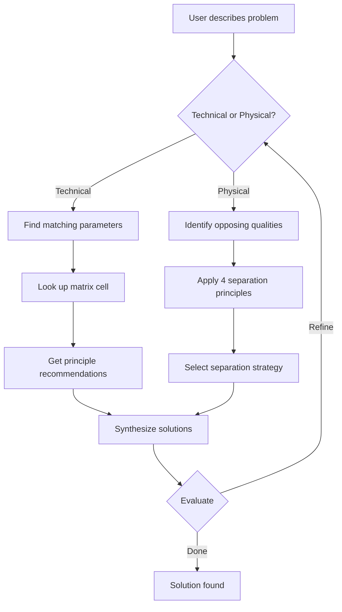
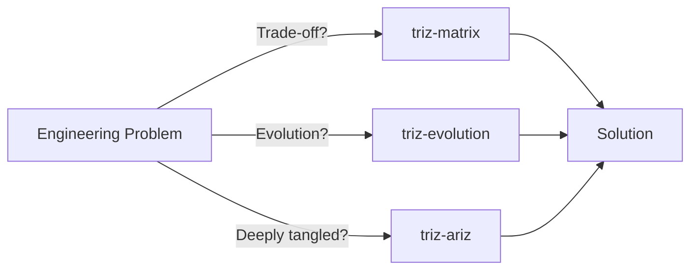
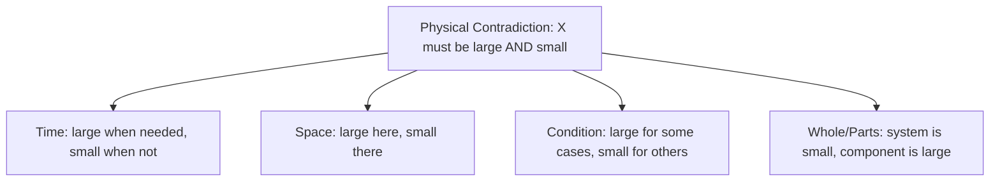

> ⚠️ **This README is for humans only.** LLM agents must NOT reference or load this file from SKILL.md. All instructions for the agent go in SKILL.md exclusively.

# TRIZ Contradiction Matrix for Software Engineering

**Resolve trade-offs systematically.** When improving one quality degrades another, use Altshuller's contradiction matrix and 40 inventive principles to find non-obvious solutions.

---

## What This Skill Does

The TRIZ contradiction matrix helps you **escape apparent trade-offs** by:

1. **Mapping your problem to engineering parameters** — translates vague "X vs Y" conflicts into Altshuller's 39 engineering parameters (with software-specific mappings)
2. **Consulting the 39×39 contradiction matrix** — identifies which of 40 inventive principles apply to your specific contradiction
3. **Analyzing physical contradictions separately** — when something must be both "large AND small", applies 4 separation principles (time, space, condition, whole/parts)
4. **Synthesizing non-obvious solutions** — combines principles with your domain knowledge to find elegant trade-off busters

The skill includes:

- **All 39 Altshuller parameters with software interpretations** — each parameter explained with how to recognize it in your codebase
- **40 inventive principles with software examples** — not just physics, but architecture, component design, state management, etc.
- **Full 1462-cell contradiction matrix** — recommendations for every parameter pair
- **Substance-Field (Vepole) analysis prep** — identifies what forces interact in your system

---

## When to Use This Skill

### ✅ Use This When You Face a Trade-Off

**Technical contradictions** — improving parameter A worsens parameter B:

| Problem | Reformulated | Why Use This |
|---------|--------------|------------|
| "Making the component more interactive increases bundle size" | Speed ↔ Bundle size / memory footprint | Matrix finds principles that decouple them |
| "Adding input validation slows down form rendering" | Speed ↔ Reliability / Controllability | Shows 6–8 principles (buffering, parallelization, feedback) |
| "More detailed error tracking hurts rendering performance" | Ease of operation ↔ Speed | Principles like dynamic/conditional logging, feedback loops |
| "Memoization improves render speed but increases stale data risk" | Reliability ↔ Adaptability | Separation in time, periodic refresh logic |
| "Making the schema more flexible reduces type safety" | Complexity ↔ Reliability | Introduces hierarchy, segmentation, local quality |
| "Increasing test coverage slows down the build pipeline" | Reliability ↔ Speed (production metrics) | Parallelization, feedback, dynamic execution |

**Physical contradictions** — something must be BOTH qualities simultaneously:

| Problem | Reformulated | Why Use This |
|---------|--------------|------------|
| "The Redux store must be normalized (performance) AND denormalized (ease of use)" | Structure: normalized ↔ denormalized | Apply separation in time (denormalize at read via selectors), space (normalized store + denormalized view models), or condition (normalize collections, denormalize singletons) |
| "The schema must be strict (safety) AND flexible (evolution)" | Rigidity: high ↔ low | Separation in space (versioning layers), condition (validated subset vs extension), whole/parts (core immutable + peripheral mutable) |
| "Type checks must be strict (safety) AND loose (developer velocity)" | Constraint value: strict ↔ loose | Separation in condition (strict for public API, loose for internal) or time (strict at build, loose at dev time with `// @ts-expect-error`) |

### ❌ When NOT to Use This Skill

**Use `triz-evolution` instead** if you're asking:

- "Where should this system go architecturally in 2–5 years?"
- "Is our monolith mature enough to split into services?"
- "What's the natural evolution path for this product?"

**Use `triz-ariz` instead** if:

- The problem has 3+ layers of interdependency (contradictions within contradictions)
- You've already tried the matrix and need deeper analysis
- The system is complex enough that Substance-Field modeling is needed

**Use **neither** TRIZ skill if:

- The problem is purely technical (algorithmic), not a trade-off (no TRIZ needed — just code better)
- You're stuck on a specific library/language limitation (needs research, not systematic invention)
- The contradiction is artificial (false dichotomy — re-scope the problem first)

---

## How It Works: The Workflow



### Step 1: Reformulation

You describe the problem in natural language:
> "We need the participant grid to render faster, but virtualizing everything makes the code much more complex."

The skill reformulates as a **technical contradiction**:

- **Worsening parameter:** Complexity (code maintainability)
- **Improving parameter:** Speed of operation (render performance)
- **Trade-off:** Speed ↔ Complexity

### Step 2: Parameter Mapping

The skill maps your domain language to **Altshuller's 39 engineering parameters**:

```text
Speed of operation ← render time, frame rate, time-to-interactive
Complexity         ← code maintainability, abstraction layers, cognitive load
```

This connects your domain language to the universal matrix.

### Step 3: Matrix Lookup

Cell [Speed, Complexity] points to **principles #1, #15, #35, #2**:

| Principle | Name | Software Example |
|-----------|------|------------------|
| #1 | Segmentation | Virtualize only the scrollable grid; keep toolbar and controls as plain components |
| #15 | Dynamics | Switch between simple layout (few participants) and virtualized layout (many participants) dynamically |
| #35 | Transformation | Instead of virtualizing DOM nodes, transform rendering strategy (CSS Grid for small N, virtual list for large N) |
| #2 | Taking out | Extract the virtualization logic into a reusable hook, keeping the component itself simple |

### Step 4: Synthesis

You **combine principles with domain knowledge**:

- **Segmentation + Dynamics** → adaptive grid: simple CSS Grid for <=9 participants, virtualized list for 10+
- **Taking out** → extract `useVirtualGrid` hook, keep `ParticipantGrid` component under 50 lines
- **Transformation** → render placeholder tiles with CSS aspect-ratio, mount video streams only when visible

**Result:** Fast rendering AND maintainable code — trade-off busted.

---

## The Three TRIZ Skills: Who Does What?



**Quick decision tree:**

- **"I have competing requirements"** → `triz-matrix` (40 principles resolve contradictions)
- **"I need to plan architecture evolution"** → `triz-evolution` (9 evolution laws + patterns)
- **"The problem has nested contradictions"** → `triz-ariz` (full 9-part systematic algorithm)

---

## Real Examples

### Example 1: Render Speed vs. Prop Validation Strictness

**Problem:**
> "Form components are slow because we validate every field on each keystroke. But we can't skip validation — the UX is broken without immediate feedback."

**Contradiction Reformulated:**

- **Improving:** Reliability (validation coverage)
- **Worsening:** Speed (render performance)

**Matrix Lookup:**
Reliability ↔ Speed → Principles #1, #15, #19, #25

- **#1 Segmentation:** Validate on blur for most fields, on change only for critical ones (e.g., meeting ID format)
- **#15 Dynamics:** Debounce validation; validate synchronously for simple rules (required, length), async for complex ones (server-side uniqueness check)
- **#25 Self-service:** Use HTML5 native validation for basic checks (`required`, `pattern`, `maxLength`), custom validation only for business rules

**Solution:**

```text
Form input
  ├─ Keystroke: native HTML5 constraint validation only (0ms, no re-render)
  ├─ Debounced (300ms): synchronous business rules (format, cross-field)
  └─ On blur: async validation (API check, cached per field value)
```

Result: Smooth typing experience, same validation coverage, fewer re-renders.

---

### Example 2: Component Library Size vs. Tree-Shaking

**Problem:**
> "rcv-ui exports 80+ components but consumers only use 10-15. Importing the library adds 200KB to the bundle. But splitting into separate packages creates dependency hell."

**Contradiction Reformulated:**

- **Improving:** Completeness (full component library)
- **Worsening:** Quantity of energy consumed (bundle size)

**This is also a PHYSICAL contradiction:**

- Library must be **large** (complete) AND **small** (tree-shakeable)

**Apply Separation Principles:**

| Principle | Approach |
|-----------|----------|
| **Time** | Lazy-load rarely-used components (`React.lazy` for modals, settings panels, admin views). |
| **Space** | Core package (Button, Input, Icon — always loaded) + extensions package (Charts, RichEditor — opt-in). |
| **Condition** | Proper `exports` field in package.json so bundlers only include what is actually imported. |
| **Whole/Parts** | Monorepo packages with a unified API surface; each component is a separate entry point internally. |

**Solution:**

```text
rcv-ui/core: 15 components (40KB, always loaded)
rcv-ui/extended: 65+ components (lazy-loaded per route)
package.json "exports": per-component entry points
Webpack sideEffects: false for full tree-shaking
```

Result: Initial bundle reduced from 200KB to 40KB, full library still available on demand.

---

### Example 3: Schema Evolution vs Type Safety

**Problem:**
> "We need to evolve meeting settings schemas (add new fields), but TypeScript union types are exploding. We can't support both v1 and v2 settings without duplicating validation logic."

**Contradiction Reformulated:**

- **Improving:** Adaptability (schema flexibility)
- **Worsening:** Complexity (type safety, maintainability)

**Matrix Lookup:**
Adaptability ↔ Complexity → Principles #1, #4, #13, #35

- **#1 Segmentation:** Split schema by version (PromptV1 ∩ PromptV2), inherit common fields
- **#4 Asymmetry:** Version-aware discriminated unions (`{ type: 'v1' } | { type: 'v2' }`)
- **#13 Inversion:** Instead of "add fields," migrate data forward at read time (lazy)
- **#35 Transformation:** Store schema version; coerce at boundary, work with canonical form internally

**Solution:**

```typescript
// Zod discriminated union
const Prompt = z.discriminatedUnion('version', [
  z.object({ version: z.literal('v1'), style: z.string() }),
  z.object({ version: z.literal('v2'), style: z.string(), exclude: z.string() }),
]);

// Coerce + validate at intake
const canonical = Prompt.parse(input).pipe(migrateToLatest);
```

Result: One validation pipeline, zero duplication, easy to add v3.

---

## How to Use: Practical Workflow

### Interactive Mode (Recommended)

```bash
# Start the skill in Claude Code, Codex, or Cowork
/triz-matrix
```

**The skill will:**

1. Ask you to describe the problem (what's improving, what's worsening?)
2. Reformulate as technical vs physical contradiction
3. Suggest parameter matches (confirm or refine)
4. Show you the matrix cell + principle recommendations
5. Discuss synthesis with examples
6. Iterate until you have a solution

### Manual Mode (Advanced)

```bash
# Look up matrix cell (requires jq)
./lookup_matrix.sh --improve 9 --worsen 25
```

Parameters, principles, and software mapping are all inlined in SKILL.md.

---

## Key Concepts: The 39 Parameters

Altshuller's 39 engineering parameters span **all domains**. Here's the **software-specific subset**:

| # | Parameter | Software Meaning | Example |
|----|-----------|-----------------|---------|
| 1 | Weight of moving object | Latency / response time | HTTP request → response |
| 2 | Weight of stationary object | Code size / memory footprint | Binary size, heap usage |
| 3 | Length of moving object | Data structure size / dimension | Array length, record width |
| 9 | Speed | Throughput / operations per second | Requests/sec, cache hit rate |
| 11 | Stress or pressure | CPU load / resource contention | Process load, GC pauses |
| 12 | Shape | Code structure / architecture | Layering, separation of concerns |
| 25 | Loss of energy | Efficiency / waste (computation, I/O) | Redundant fetches, memory leaks |
| 26 | Quantity of substance | Data volume / database size | Row count, key-value pairs |
| 27 | Reliability | System robustness / fault tolerance | Uptime, error handling, validation |
| 28 | Accuracy of measurement | Type precision / validation strictness | Decimal places, schema constraints |
| 30 | External harm reduction | Security / PII protection | Encryption, access control, sanitization |
| 31 | Harmful side effects | Technical debt / system complexity | Tight coupling, legacy code |
| 34 | Ease of operation | Usability / DX | API ergonomics, CLI clarity, docs |
| 35 | Repairability | Debuggability / testability | Error messages, observability, logs |
| 37 | Complexity | Algorithmic/architectural complexity | O(n), cyclomatic complexity |
| 39 | Productivity | Developer velocity / throughput | Build time, feedback loop latency |

(Full 39-parameter table with software interpretations in SKILL.md)

---

## The 40 Inventive Principles (Software Edition)

Each principle is **language-independent**, with **software-specific interpretations**:

| # | Principle | Hardware | Software |
|----|-----------|----------|----------|
| 1 | Segmentation | Split object into parts | Partition data by temperature, tenant, version |
| 2 | Taking out | Remove harmful component | Deduplicate, lazy-load, extract pure functions |
| 3 | Local quality | Different parts, different properties | Tiered caching, graduated validation, role-based access |
| 4 | Asymmetry | Break symmetry to gain advantage | Discriminated unions, request-reply asymmetry |
| 5 | Merging | Combine operations | Batch processing, transactional bundling |
| 6 | Universality | One system, multiple purposes | Generic types, plugin architecture |
| 7 | Nesting | Objects within objects | Recursive types, hierarchical storage |
| 8 | Anti-weight | Counteract, not remove | Caching counteracts latency, indexes counteract scan cost |
| 9 | Preliminary action | Prepare before main event | Pre-caching, eager loading, connection pooling |
| 10 | Preliminary counter-action | Prepare for opposite | Circuit breaker, graceful degradation |
| 11 | Beforehand cushioning | Protect from harm | Rate limiting, input validation, error boundaries |
| 12 | Equipotentiality | Avoid potential energy differences | Level-playing-field testing, consistent latency SLOs |
| 13 | Do the opposite | Invert the approach | Pull instead of push, lazy eval instead of eager |
| 14 | Spheroidality | Round/curved instead of sharp | Gradual retries (exponential backoff), smooth transitions |
| 15 | Dynamics | Make properties variable | Adaptive limits, dynamic scaling, context-dependent behavior |
| 16 | Partial or excessive action | Go too far to find optimum | Over-cache to find threshold, over-log then filter |
| 17 | Another dimension | Use new axis | Cache by time AND space, multi-tiered validation |
| 18 | Mechanical vibration | Oscillation / periodic action | Health checks, periodic cleanup, cache invalidation |
| 19 | Periodic action | Discrete cycles | Batch processing, cron jobs, polling loops |
| 20 | Continuity of useful action | No stops or gaps | Streaming instead of request/reply, background workers |
| 21 | Skipping | Miss some steps safely | Conditional validation, feature flags, fallbacks |
| 22 | "Blessing in disguise" | Use negative side effect positively | Errors as feedback (observability), retries as resilience |
| 23 | Feedback | Return information to control | Logging, metrics, error codes, user feedback loops |
| 24 | Intermediary | Introduce mediating agent | Message queue, API gateway, circuit breaker |
| 25 | Self-service | Customer performs function | Client-side validation, browser-cached data, peer-to-peer |
| 26 | Copying | Replace with simulation | Mocking in tests, synthetic data, canary deployments |
| 27 | Cheap, short-lived objects | Disposable instead of durable | Temporary files, session tokens, ephemeral containers |
| 28 | Replacement of mechanical system | Replace with electrical/chemical | Replace batch jobs with streaming, REST with WebSocket |
| 29 | Pneumatics & hydraulics | Use fields instead of solids | Event-driven over state machines, pub/sub over polling |
| 30 | Flexible shells & thin films | Use thin boundary | Microservices, thin client, API boundaries |
| 31 | Porous material | Use voids strategically | Sparse indexes, probabilistic data structures, bloom filters |
| 32 | Optical property | Change color/transparency | Feature flags, gradual rollout, visibility controls |
| 33 | Homogeneity | Use same material/logic | Treat all requests uniformly, consistent error handling |
| 34 | Discarding & recovering | Remove used parts, add new | Garbage collection, purging stale data, version rotation |
| 35 | Transformation | Convert to different form | Serialize, denormalize, transform at boundary |
| 36 | Phase transition | Use change of state | Lazy evaluation, caching state changes, event sourcing |
| 37 | Thermal expansion | Use state change properties | Compression, encoding, format negotiation |
| 38 | Strong oxidants | Use environment/catalyst | Leverage cloud infra, serverless, container orchestration |
| 39 | Inert atmosphere | Isolate from harmful environment | Sandbox, containerization, access control, secrets management |
| 40 | Composite materials | Combine properties | Hybrid caching (cache + log), polyglot persistence |

---

## Physical Contradictions: The 4 Separation Principles

When something must be **both large AND small** (or both fast AND safe), apply separation:



**Example:** Component rendering budget — the app must render **many** components (feature-complete) but keep the critical path **short** (fast time-to-interactive).

| Separation | Solution |
|-----------|----------|
| **Time** | Critical-path components render immediately (participant tiles, toolbar). Secondary components lazy-loaded after first paint. |
| **Space** | Above-the-fold components are eagerly rendered; below-fold and off-screen components are virtualized. |
| **Condition** | Render full UI for active speaker view (5 tiles, 95% of screen time); lazy-render gallery view only when user switches. |
| **Whole/Parts** | The "meeting view" as a whole is lightweight (shell + slots). Each slot independently mounts its heavy content. |

**Best choice:** Combination of Time + Space + Condition = prioritized rendering with virtualization and route-based code splitting.

---

## Troubleshooting

### "The matrix doesn't apply to my problem."

**This means:**

- The contradiction is **false** (you can have both; re-scope). E.g., "I want fast API AND fast CI" — these don't conflict.
- The problem is **purely algorithmic** (no trade-off). E.g., "How do I sort faster?" — use mergesort, not TRIZ.
- You need **evolution thinking**, not contradiction resolution. E.g., "Should we go serverless?" — use `triz-evolution`.

**Action:** Try `triz-evolution` or `triz-ariz`, or reframe the problem.

---

### "I got principles, but how do I apply them?"

The skill gives you **inventive principles** (thinking directions), not code.

**Your job is to synthesize** with domain knowledge:

> Principle #1 Segmentation + #15 Dynamics
> = "Partition AND vary"
> = Adaptive participant grid that switches layout strategy based on participant count.

This requires creative thinking — TRIZ opens doors, you walk through them.

---

### "The matrix contradicts my experience."

TRIZ is **universal** but **probabilistic**. The matrix encodes patterns from **thousands of patents**, not 100% guaranteed solutions.

**Your engineering intuition is valuable.** If a principle doesn't fit your constraints, **skip it and try the next one**. The matrix gives options, not mandates.

---

## Further Reading

- **Altshuller, G. S.** (2005). *The Innovation Algorithm: TRIZ, Systematic Innovation and Technical Creativity.* Technical Innovation Center. (Original TRIZ research)
- **Rantanen, K. & Domb, E.** (2008). *Simplified TRIZ: New Problem-Solving Applications for Engineers and Manufacturing Professionals.* CRC Press. (Practical software + manufacturing examples)

---

## Quick Reference

```bash
# Look up matrix cell for a contradiction (requires jq)
sh scripts/lookup_matrix.sh --improve 9 --worsen 25

# Interactive (guided)
/triz-matrix
```

Parameters, principles, and software mapping are inlined in SKILL.md — no separate lookup needed.

---

**Dependencies:** `jq` (for matrix lookup script only)
